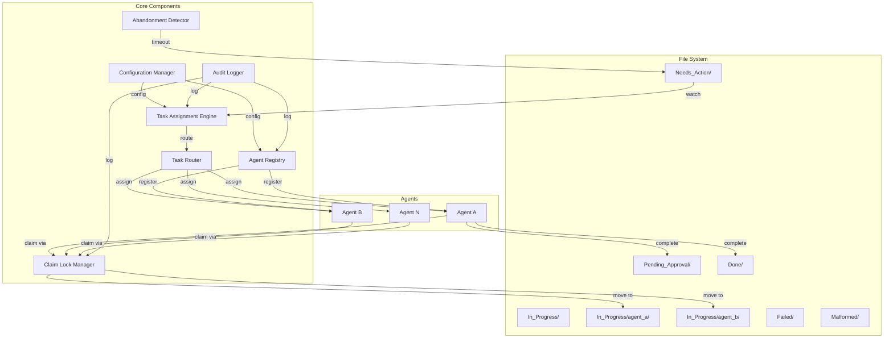

# Design Document: Agent Work Assignment and Tracking System

## Overview

The Agent Work Assignment and Tracking System is a file-based task orchestration system that manages work distribution across multiple AI agents operating within an Obsidian vault. The system uses folder structures and file movements to represent task state transitions, with atomic file operations preventing race conditions during concurrent agent operations.

The architecture follows a distributed coordination model where agents operate autonomously while a central registry and assignment engine coordinate task distribution. The system leverages the existing Ralph Loop architecture (Perception → Reasoning → Action) and integrates with existing components like ConfigurationManager and AuditLogger.

Key design principles:
- **File-based state management**: Task state is represented by file location and frontmatter metadata
- **Atomic operations**: All file movements use atomic operations to prevent race conditions
- **Autonomous agents**: Agents operate independently with minimal central coordination
- **Observable system**: All state changes are logged and visible through the file system
- **Graceful degradation**: System continues operating even if individual agents fail

## Architecture

### System Components



### Component Responsibilities

**Agent Registry**
- Maintains list of active agents with their capabilities and capacity
- Creates and manages In_Progress subfolders for each agent
- Tracks agent heartbeats and liveness status
- Provides agent lookup and status query APIs

**Task Assignment Engine**
- Monitors Needs_Action folder for new tasks
- Maintains priority queue of available tasks
- Implements assignment strategies (round-robin, priority-first, least-loaded, capability-match)
- Notifies eligible agents of available tasks
- Coordinates with Task Router for capability-based routing

**Task Router**
- Parses task metadata to determine required capabilities
- Matches tasks to agents based on capability requirements
- Filters agent list to only those qualified for specific tasks
- Handles tasks with no capability requirements (broadcast to all agents)

**Claim Lock Manager**
- Provides atomic claim operations to prevent race conditions
- Uses file system locks or atomic rename operations
- Implements retry logic with exponential backoff
- Releases stale locks after timeout
- Returns claim success/failure to agents

**Abandonment Detector**
- Monitors In_Progress folders for tasks exceeding timeout
- Tracks agent heartbeat status
- Reclaims tasks from unresponsive agents
- Moves timed-out tasks back to Needs_Action
- Tracks reclaim count and moves repeatedly failed tasks to Failed folder

**Configuration Manager** (existing component)
- Loads system configuration from YAML/JSON file
- Validates configuration parameters
- Supports hot-reloading of configuration changes
- Provides configuration access to all components

**Audit Logger** (existing component)
- Logs all task state transitions
- Records agent actions (claim, complete, abandon)
- Writes structured JSON log entries
- Supports log rotation and archival

## Components and Interfaces

### Agent Registry

```typescript
interface AgentMetadata {
  agentId: string;
  capabilities: string[];
  maxConcurrentTasks: number;
  maxTasksByType: Map<string, number>;
  status: 'active' | 'inactive' | 'unresponsive';
  lastHeartbeat: Date;
  registeredAt: Date;
}

interface AgentRegistry {
  // Registration
  registerAgent(metadata: AgentMetadata): Promise<void>;
  deregisterAgent(agentId: string): Promise<void>;
  
  // Heartbeat
  recordHeartbeat(agentId: string): Promise<void>;
  getAgentStatus(agentId: string): Promise<AgentMetadata>;
  
  // Queries
  listActiveAgents(): Promise<AgentMetadata[]>;
  getAgentsByCapability(capability: string): Promise<AgentMetadata[]>;
  getAgentWorkload(agentId: string): Promise<number>;
  
  // Capacity
  hasCapacity(agentId: string): Promise<boolean>;
  hasCapacityForType(agentId: string, taskType: string): Promise<boolean>;
}
```

### Task Assignment Engine

```typescript
interface TaskMetadata {
  taskId: string;
  priority: 'critical' | 'high' | 'medium' | 'low';
  taskType: string;
  requiredCapabilities: string[];
  createdAt: Date;
  claimedAt?: Date;
  claimedBy?: string;
  completedAt?: Date;
  reclaimCount: number;
  timeoutMinutes: number;
}

interface TaskAssignmentEngine {
  // Task discovery
  startWatching(): Promise<void>;
  stopWatching(): Promise<void>;
  
  // Task queue management
  getAvailableTasks(): Promise<TaskMetadata[]>;
  getTasksByPriority(priority: string): Promise<TaskMetadata[]>;
  
  // Assignment strategies
  setStrategy(strategy: AssignmentStrategy): void;
  assignNextTask(agentId: string): Promise<TaskMetadata | null>;
  
  // Notifications
  notifyAgentsOfTask(task: TaskMetadata): Promise<void>;
}

type AssignmentStrategy = 
  | 'round-robin' 
  | 'priority-first' 
  | 'least-loaded' 
  | 'capability-match';
```

### Task Router

```typescript
interface TaskRouter {
  // Capability matching
  getEligibleAgents(task: TaskMetadata): Promise<string[]>;
  canAgentHandleTask(agentId: string, task: TaskMetadata): Promise<boolean>;
  
  // Routing rules
  addRoutingRule(rule: RoutingRule): void;
  removeRoutingRule(ruleId: string): void;
  evaluateRoutingRules(task: TaskMetadata): Promise<string[]>;
}

interface RoutingRule {
  ruleId: string;
  condition: (task: TaskMetadata) => boolean;
  targetAgents: string[];
  priority: number;
}
```

### Claim Lock Manager

```typescript
interface ClaimResult {
  success: boolean;
  taskId: string;
  agentId: string;
  error?: string;
}

interface ClaimLockManager {
  // Atomic claim operations
  attemptClaim(taskId: string, agentId: string): Promise<ClaimResult>;
  releaseClaim(taskId: string, agentId: string): Promise<void>;
  
  // Lock management
  acquireLock(taskId: string): Promise<boolean>;
  releaseLock(taskId: string): Promise<void>;
  releaseStaleLocksOlderThan(seconds: number): Promise<void>;
}
```

### Abandonment Detector

```typescript
interface AbandonmentDetector {
  // Monitoring
  startMonitoring(): Promise<void>;
  stopMonitoring(): Promise<void>;
  
  // Detection
  detectTimedOutTasks(): Promise<TaskMetadata[]>;
  detectUnresponsiveAgents(): Promise<string[]>;
  
  // Reclaim
  reclaimTask(taskId: string, reason: string): Promise<void>;
  reclaimAllTasksFromAgent(agentId: string): Promise<void>;
  
  // Configuration
  setTaskTimeout(taskType: string, minutes: number): void;
  setHeartbeatTimeout(seconds: number): void;
}
```

### Agent Interface

```typescript
interface Agent {
  // Lifecycle
  start(): Promise<void>;
  shutdown(gracePeriod: number): Promise<void>;
  
  // Registration
  register(): Promise<void>;
  deregister(): Promise<void>;
  sendHeartbeat(): Promise<void>;
  
  // Task operations
  discoverTasks(): Promise<TaskMetadata[]>;
  claimTask(taskId: string): Promise<ClaimResult>;
  completeTask(taskId: string, destination: string): Promise<void>;
  releaseTask(taskId: string): Promise<void>;
  
  // Status
  getCurrentTasks(): Promise<TaskMetadata[]>;
  getCapacity(): Promise<number>;
}
```

## Data Models

### Task File Structure

Task files are markdown documents with YAML frontmatter containing metadata:

```yaml
---
taskId: "task_20240115_123456"
priority: "high"
taskType: "email_processing"
requiredCapabilities: ["email", "nlp"]
createdAt: "2024-01-15T12:34:56Z"
claimedAt: "2024-01-15T12:35:10Z"
claimedBy: "agent_social_media"
status: "in_progress"
reclaimCount: 0
timeoutMinutes: 30
---

# Task: Process Customer Email

## Description
Process incoming customer email and generate response draft.

## Context
- Customer: John Doe
- Subject: Question about invoice #12345
- Priority: High

## Expected Output
- Response draft in Pending_Approval folder
```

### Agent Configuration File

```yaml
agents:
  - agentId: "agent_social_media"
    capabilities: ["social_media", "content_generation", "image_processing"]
    maxConcurrentTasks: 3
    maxTasksByType:
      social_media_post: 2
      image_generation: 1
    heartbeatIntervalSeconds: 30
    
  - agentId: "agent_invoices"
    capabilities: ["accounting", "pdf_generation", "email"]
    maxConcurrentTasks: 5
    maxTasksByType:
      invoice_generation: 3
      payment_processing: 2
    heartbeatIntervalSeconds: 30
```

### System Configuration

```yaml
system:
  taskTimeouts:
    default: 30
    email_processing: 15
    invoice_generation: 45
    social_media_post: 20
  
  heartbeat:
    intervalSeconds: 30
    missedHeartbeatsBeforeUnresponsive: 3
  
  claimLock:
    maxLockDurationSeconds: 10
    retryAttempts: 3
    retryBackoffMs: [100, 500, 1000]
  
  abandonment:
    checkIntervalSeconds: 60
    maxReclaimAttempts: 3
  
  assignmentStrategy: "priority-first"
  
  folders:
    needsAction: "Needs_Action"
    inProgress: "In_Progress"
    pendingApproval: "Pending_Approval"
    done: "Done"
    failed: "Failed"
    malformed: "Malformed"
```

### Audit Log Entry

```json
{
  "timestamp": "2024-01-15T12:35:10.123Z",
  "eventType": "task_claimed",
  "taskId": "task_20240115_123456",
  "agentId": "agent_social_media",
  "sourceFolder": "Needs_Action",
  "destinationFolder": "In_Progress/agent_social_media",
  "metadata": {
    "priority": "high",
    "taskType": "email_processing",
    "attemptNumber": 1
  }
}
```

## Correctness Properties

*A property is a characteristic or behavior that should hold true across all valid executions of a system—essentially, a formal statement about what the system should do. Properties serve as the bridge between human-readable specifications and machine-verifiable correctness guarantees.*


### Property 1: Agent Registration Round-Trip
*For any* agent with valid metadata (agentId, capabilities, capacity limits), after registering the agent, querying the Agent_Registry should return the same metadata, and the agent's In_Progress folder should exist.
**Validates: Requirements 1.1, 1.2, 9.2, 17.1**

### Property 2: Duplicate Registration Rejection
*For any* agent that is already registered, attempting to register another agent with the same agentId should fail with an error and not modify the existing agent's metadata.
**Validates: Requirements 1.5**

### Property 3: Agent Deactivation Prevents Assignment
*For any* registered agent, after marking it as inactive (shutdown or unresponsive), the Task_Assignment_Engine should not assign new tasks to that agent.
**Validates: Requirements 1.3**

### Property 4: Registry Configuration Synchronization
*For any* sequence of agent registration and deregistration operations, the Agent_Registry configuration file should always reflect the current set of registered agents.
**Validates: Requirements 1.4**

### Property 5: Task Metadata Parsing Accuracy
*For any* task file with valid frontmatter metadata, parsing the file should correctly extract priority, taskType, requiredCapabilities, and other metadata fields.
**Validates: Requirements 2.2**

### Property 6: Task Queue Priority Ordering
*For any* set of tasks in Needs_Action, the Task_Assignment_Engine's queue should be ordered first by priority (critical > high > medium > low), then by timestamp (FIFO) for tasks with equal priority.
**Validates: Requirements 2.3, 8.1, 8.4**

### Property 7: Task Queue Synchronization
*For any* task file removed from Needs_Action by external means, the Task_Assignment_Engine's internal queue should no longer contain that task.
**Validates: Requirements 2.4**

### Property 8: Default Priority Assignment
*For any* task file without an explicit priority field, the System should assign a default priority of "medium".
**Validates: Requirements 8.2**

### Property 9: Priority Value Validation
*For any* task file with a priority value not in the set {critical, high, medium, low}, the System should reject the task and move it to the Malformed folder.
**Validates: Requirements 8.3, 18.3**

### Property 10: Atomic Task Claim
*For any* task in Needs_Action and any agent with available capacity, when the agent claims the task, the task file should move atomically from Needs_Action to In_Progress/<agent_id> with updated frontmatter (claimedAt, claimedBy, status).
**Validates: Requirements 3.1, 3.2**

### Property 11: Failed Claim Atomicity
*For any* task claim operation that fails (due to conflict, missing file, or error), the task should remain in its original location with unchanged metadata.
**Validates: Requirements 3.4**

### Property 12: Mutual Exclusion on Claims
*For any* task in Needs_Action, when multiple agents attempt to claim it concurrently, exactly one agent should succeed and all others should receive a claim failure.
**Validates: Requirements 4.1**

### Property 13: Workload Query Accuracy
*For any* agent, querying the agent's workload should return exactly the set of tasks currently in that agent's In_Progress folder with accurate metadata.
**Validates: Requirements 5.1, 5.3**

### Property 14: Elapsed Time Tracking
*For any* task in an In_Progress folder, the System should correctly calculate the elapsed time as the difference between the current time and the claimedAt timestamp.
**Validates: Requirements 5.2**

### Property 15: Real-Time Metrics Updates
*For any* task state transition (claim, complete, reclaim), the System's workload metrics should update immediately to reflect the new state.
**Validates: Requirements 5.5**

### Property 16: Task Completion File Movement
*For any* task in In_Progress/<agent_id>, when the agent completes the task, the task file should move to the designated completion folder based on task type with updated frontmatter (completedAt, final status).
**Validates: Requirements 6.1, 6.2**

### Property 17: Completion Destination Routing
*For any* task type with a configured completion destination, completing a task of that type should move it to the correct destination folder (Pending_Approval, Done, etc.).
**Validates: Requirements 6.3**

### Property 18: Failed Completion Atomicity
*For any* task completion operation that fails, the task should remain in the In_Progress folder with unchanged metadata.
**Validates: Requirements 6.4**

### Property 19: Capacity Tracking on Completion
*For any* task completion, the agent's current task count should decrement by one, freeing capacity for new tasks.
**Validates: Requirements 6.5**

### Property 20: Capacity Enforcement on Claim
*For any* agent at maximum capacity (current task count equals maxConcurrentTasks), attempting to claim a new task should fail with a capacity error.
**Validates: Requirements 7.2**

### Property 21: Capacity Calculation Accuracy
*For any* agent, the calculated available capacity should equal maxConcurrentTasks minus the number of task files currently in the agent's In_Progress folder.
**Validates: Requirements 7.5, 17.5**

### Property 22: Dynamic Capacity Adjustment
*For any* agent, changing the maxConcurrentTasks configuration should immediately affect future capacity checks without requiring system restart.
**Validates: Requirements 7.4**

### Property 23: Capability-Based Task Routing
*For any* task with requiredCapabilities specified, the Task_Router should only offer the task to agents whose capability set includes all required capabilities.
**Validates: Requirements 9.1**

### Property 24: Multiple Capabilities Support
*For any* task with multiple requiredCapabilities and any agent with multiple capabilities, the Task_Router should correctly match tasks to agents based on set intersection.
**Validates: Requirements 9.4**

### Property 25: No-Capability Task Availability
*For any* task with no requiredCapabilities (empty or missing field), the Task_Router should make the task available to all registered agents.
**Validates: Requirements 9.5**

### Property 26: Unresponsive Agent Task Reclaim
*For any* agent marked as unresponsive, all tasks in that agent's In_Progress folder should be moved back to Needs_Action for reassignment.
**Validates: Requirements 10.3**

### Property 27: Heartbeat Timestamp Tracking
*For any* agent sending a heartbeat, the Agent_Registry should update that agent's lastHeartbeat timestamp to the current time.
**Validates: Requirements 10.4**

### Property 28: Task Timeout Detection and Reclaim
*For any* task in an In_Progress folder where (current time - claimedAt) exceeds the configured timeout duration, the Abandonment_Detector should move the task back to Needs_Action and increment its reclaimCount.
**Validates: Requirements 11.2, 11.4**

### Property 29: Configurable Timeout Per Task Type
*For any* task type with a configured timeout duration, tasks of that type should use the configured timeout; otherwise, they should use the default timeout of 30 minutes.
**Validates: Requirements 11.3**

### Property 30: Failed Task Handling
*For any* task with reclaimCount greater than 3, the System should move the task to the Failed folder and log an alert instead of returning it to Needs_Action.
**Validates: Requirements 11.5**

### Property 31: Comprehensive Audit Logging
*For any* task state transition (claim, complete, reclaim, reassign), the AuditLogger should write a structured JSON log entry containing taskId, agentId, timestamp, source folder, destination folder, and event type.
**Validates: Requirements 12.1, 12.2, 12.3, 12.4, 13.4**

### Property 32: Task Reassignment Metadata Cleanup
*For any* task reassignment operation, the task should move from In_Progress/<agent_id> to Needs_Action with claimedBy and claimedAt fields cleared from frontmatter.
**Validates: Requirements 13.1, 13.2**

### Property 33: Bulk Agent Task Reassignment
*For any* agent with multiple tasks in progress, reassigning all tasks from that agent should move all task files from In_Progress/<agent_id> to Needs_Action.
**Validates: Requirements 13.3**

### Property 34: System Metrics Accuracy
*For any* system state, querying system metrics should return accurate counts of tasks in each state (Needs_Action, In_Progress per agent, completed) that match the actual file counts in those folders.
**Validates: Requirements 14.1, 14.2**

### Property 35: Average Completion Time Calculation
*For any* agent or task type, the average completion time metric should equal the sum of all task durations divided by the number of completed tasks.
**Validates: Requirements 14.3**

### Property 36: Timeout and Reclaim Tracking
*For any* sequence of task operations, the System should accurately track and report the total number of task timeouts and reclaims that have occurred.
**Validates: Requirements 14.4**

### Property 37: Metrics API JSON Format
*For any* metrics query, the API should return valid JSON with the expected structure containing all required metric fields.
**Validates: Requirements 14.5**

### Property 38: Graceful Shutdown Task Release
*For any* agent with in-progress tasks, when the agent shuts down and the grace period expires, all remaining tasks should move from In_Progress/<agent_id> to Needs_Action.
**Validates: Requirements 15.3**

### Property 39: Shutdown Deregistration
*For any* agent completing shutdown, the agent should be removed from the Agent_Registry and marked as inactive.
**Validates: Requirements 15.4**

### Property 40: Shutdown Audit Logging
*For any* agent shutdown operation, all task movements during shutdown should be logged with appropriate event types and metadata.
**Validates: Requirements 15.5**

### Property 41: Round-Robin Distribution
*For any* sequence of task assignments using round-robin strategy, tasks should be distributed evenly across all eligible agents (each agent receives approximately the same number of assignments).
**Validates: Requirements 16.1**

### Property 42: Priority-First Assignment
*For any* sequence of task assignments using priority-first strategy, all critical priority tasks should be assigned before any high priority tasks, all high before medium, and all medium before low.
**Validates: Requirements 16.2**

### Property 43: Least-Loaded Assignment
*For any* task assignment using least-loaded strategy, the task should be assigned to the agent with the fewest current tasks among all eligible agents.
**Validates: Requirements 16.4**

### Property 44: Runtime Strategy Change
*For any* assignment strategy change, all task assignments after the change should use the new strategy without requiring system restart.
**Validates: Requirements 16.5**

### Property 45: Per-Type Capacity Enforcement
*For any* agent with a per-type concurrency limit for a specific task type, when the agent has reached that limit for that type, attempting to claim another task of that type should fail with a capacity error.
**Validates: Requirements 17.2**

### Property 46: Default and Override Type Limits
*For any* agent with a default per-type limit and specific overrides, the System should apply the override limit for specified types and the default limit for all other types.
**Validates: Requirements 17.3**

### Property 47: Task Metadata Validation
*For any* task file in Needs_Action, if the file is missing required frontmatter fields or contains invalid values, the System should move it to the Malformed folder and log an error.
**Validates: Requirements 18.1, 18.2**

### Property 48: Task Type Validation
*For any* task with a taskType value not in the set of registered task types, the System should reject the task and move it to the Malformed folder.
**Validates: Requirements 18.4**

### Property 49: Invalid YAML Handling
*For any* task file with invalid YAML frontmatter, the System should handle the parse error gracefully, move the file to the Malformed folder, and log an error.
**Validates: Requirements 18.5**

### Property 50: Agent Performance Metrics Accuracy
*For any* agent, the performance metrics (average completion time, success rate, tasks per hour) should be calculated correctly based on the agent's task history.
**Validates: Requirements 19.1, 19.2, 19.4**

### Property 51: Time-Windowed Task Counts
*For any* agent and time window (hourly, daily, weekly), the task count for that window should equal the number of tasks completed by that agent within that time period.
**Validates: Requirements 19.3**

### Property 52: Performance Metrics by Task Type
*For any* agent, querying performance metrics should return metrics broken down by task type, with each type's metrics calculated independently.
**Validates: Requirements 19.5**

### Property 53: Configuration Loading and Validation
*For any* valid configuration file (YAML or JSON), the ConfigurationManager should load all configuration parameters correctly; for invalid configurations, it should reject them with descriptive errors.
**Validates: Requirements 20.1, 20.3**

### Property 54: Configuration Parameter Support
*For any* configuration file containing task timeout durations, heartbeat intervals, and capacity limits, the ConfigurationManager should parse and apply these values to the System.
**Validates: Requirements 20.2**

### Property 55: Hot Configuration Reload
*For any* configuration change, reloading the configuration should apply new values to future operations while preserving the state of in-flight tasks.
**Validates: Requirements 20.4, 20.5**

## Error Handling

### Error Categories

**File System Errors**
- File not found during claim or completion
- Permission denied on file operations
- Disk full or I/O errors
- Concurrent modification conflicts

**Validation Errors**
- Missing required frontmatter fields
- Invalid YAML syntax in task files
- Invalid priority or task type values
- Duplicate agent registration

**Capacity Errors**
- Agent at maximum capacity
- Agent at per-type capacity limit
- No agents available with required capabilities

**Timeout Errors**
- Task exceeds timeout duration
- Agent misses heartbeat threshold
- Claim lock held too long

**Configuration Errors**
- Invalid configuration file syntax
- Missing required configuration parameters
- Invalid configuration values

### Error Handling Strategies

**Atomic Operations**
- All file movements use atomic operations (rename, not copy-delete)
- Failed operations leave files in original state
- No partial state transitions

**Retry Logic**
- Claim operations retry up to 3 times with exponential backoff
- File system errors trigger automatic retry
- Permanent failures logged and reported

**Graceful Degradation**
- System continues operating if individual agents fail
- Tasks from failed agents automatically reclaimed
- Malformed tasks isolated without blocking valid tasks

**Comprehensive Logging**
- All errors logged with full context
- Error logs include taskId, agentId, operation, and stack trace
- Audit trail maintained for all error conditions

**User Notification**
- Critical errors (repeated task failures) generate alerts
- Configuration errors reported at startup
- Dashboard displays error counts and recent failures

## Testing Strategy

### Dual Testing Approach

The system requires both unit testing and property-based testing for comprehensive coverage:

**Unit Tests** focus on:
- Specific examples of task claim, completion, and reassignment flows
- Edge cases like empty folders, missing files, and invalid metadata
- Error conditions and recovery scenarios
- Integration points between components
- Timing-sensitive operations (heartbeats, timeouts)

**Property-Based Tests** focus on:
- Universal properties that hold across all inputs
- Comprehensive input coverage through randomization
- Concurrent operations and race condition detection
- State invariants maintained across operations
- Round-trip properties (register → query, claim → complete)

### Property-Based Testing Configuration

**Testing Library**: Use `fast-check` for TypeScript/JavaScript property-based testing

**Test Configuration**:
- Minimum 100 iterations per property test
- Each property test references its design document property
- Tag format: `Feature: agent-work-assignment, Property {number}: {property_text}`

**Example Property Test Structure**:
```typescript
// Feature: agent-work-assignment, Property 10: Atomic Task Claim
it('should atomically claim tasks with updated metadata', async () => {
  await fc.assert(
    fc.asyncProperty(
      fc.record({
        agentId: fc.string(),
        taskId: fc.string(),
        priority: fc.constantFrom('critical', 'high', 'medium', 'low'),
        taskType: fc.string()
      }),
      async ({ agentId, taskId, priority, taskType }) => {
        // Setup: Create task in Needs_Action
        // Action: Agent claims task
        // Assert: Task moved to In_Progress/<agentId> with correct metadata
      }
    ),
    { numRuns: 100 }
  );
});
```

### Test Coverage Requirements

**Component Tests**:
- Agent Registry: registration, deregistration, heartbeat, capacity tracking
- Task Assignment Engine: task discovery, queue management, assignment strategies
- Task Router: capability matching, routing rules
- Claim Lock Manager: atomic claims, lock management, conflict resolution
- Abandonment Detector: timeout detection, task reclaim, agent monitoring

**Integration Tests**:
- End-to-end task flow: Needs_Action → claim → In_Progress → complete → Done
- Multi-agent concurrent operations
- Agent failure and recovery scenarios
- Configuration hot-reload during active operations
- Metrics accuracy across state transitions

**Performance Tests**:
- Claim operation completes within 2 seconds
- Task detection within 5 seconds of file creation
- System handles 100+ concurrent agents
- Metrics queries respond within 1 second

### Testing Best Practices

- Use temporary directories for file system operations in tests
- Clean up test artifacts after each test
- Mock file system watchers for deterministic testing
- Use fake timers for timeout and heartbeat testing
- Generate random but valid task metadata for property tests
- Test both success and failure paths for all operations
- Verify audit logs contain expected entries after operations
