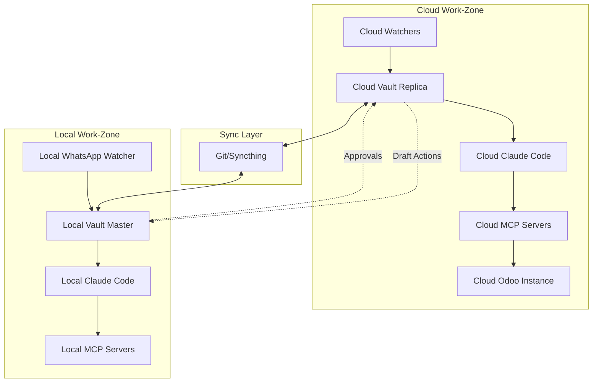

# Design Document: AI Employee System

## Overview

The AI Employee System is a progressive, tier-based autonomous assistant platform that combines perception (Watchers), knowledge management (Obsidian Vault), reasoning (Claude Code with Ralph Wiggum Loop), and action execution (MCP Servers) with human oversight (Approval Workflow). The system is designed to be built incrementally across four tiers, with each tier adding more sophisticated capabilities while maintaining security, reliability, and auditability.

The architecture follows a layered approach:
1. **Perception Layer**: Watcher scripts monitor external data sources
2. **Knowledge Layer**: Obsidian vault stores structured markdown files
3. **Reasoning Layer**: Claude Code processes information and makes decisions
4. **Action Layer**: MCP servers execute external actions
5. **Orchestration Layer**: Master orchestrator coordinates all components
6. **Security Layer**: Credential management, sandboxing, and audit logging

Key design principles:
- **Progressive Enhancement**: Each tier builds on previous functionality
- **Human-in-the-Loop**: Sensitive actions require explicit approval
- **Fail-Safe**: Graceful degradation and error recovery
- **Auditability**: Comprehensive logging of all system actions
- **Modularity**: Independent components with clear interfaces
- **Security-First**: Credentials isolated, permissions bounded

## Architecture

### System Architecture Diagram

```mermaid
graph TB
    subgraph "Perception Layer"
        GW[Gmail Watcher]
        WW[WhatsApp Watcher]
        FSW[File System Watcher]
        LW[LinkedIn Watcher]
        FBW[Facebook Watcher]
        IGW[Instagram Watcher]
        TW[Twitter Watcher]
    end

    subgraph "Knowledge Layer"
        VAULT[Obsidian Vault]
        INBOX[/Inbox]
        NEEDS[/Needs_Action]
        DONE[/Done]
        PLANS[/Plans]
        PENDING[/Pending_Approval]
        DASH[Dashboard.md]
    end

    subgraph "Reasoning Layer"
        CC[Claude Code]
        RWL[Ralph Wiggum Loop]
        AS[Agent Skills]
    end

    subgraph "Action Layer"
        EMCP[Email MCP Server]
        SMCP[Social Media MCP Server]
        OMCP[Odoo MCP Server]
    end

    subgraph "Orchestration Layer"
        ORCH[Master Orchestrator]
        WD[Watchdog Process]
        SCHED[Scheduler]
    end

    GW --> INBOX
    WW --> INBOX
    FSW --> INBOX
    LW --> INBOX
    FBW --> INBOX
    IGW --> INBOX
    TW --> INBOX

    INBOX --> CC
    CC --> NEEDS
    CC --> PLANS
    CC --> PENDING
    CC --> DONE
    CC --> DASH

    CC --> RWL
    RWL --> AS
    AS --> EMCP
    AS --> SMCP
    AS --> OMCP

    ORCH --> GW
    ORCH --> WW
    ORCH --> FSW
    ORCH --> LW
    ORCH --> FBW
    ORCH --> IGW
    ORCH --> TW
    ORCH --> CC
    ORCH --> EMCP
    ORCH --> SMCP
    ORCH --> OMCP

    WD --> ORCH
    SCHED --> ORCH
```


### Cloud/Local Work-Zone Architecture (Platinum Tier)



### Component Responsibilities

**Perception Layer (Watchers)**:
- Monitor external data sources for new content
- Create structured markdown files in /Inbox
- Run as independent processes with restart capability
- Handle authentication and rate limiting
- Log all detections with timestamps

**Knowledge Layer (Obsidian Vault)**:
- Central repository for all system state
- Structured folder hierarchy for workflow stages
- Dashboard.md for current status and summaries
- Company_Handbook.md for business context
- Plan.md files for multi-step task execution
- Approval request files for human oversight

**Reasoning Layer (Claude Code)**:
- Read and process items from /Inbox
- Make decisions using Agent Skills
- Create Plan.md files for complex tasks
- Execute Ralph Wiggum Loop for autonomous completion
- Update Dashboard.md with processing results
- Generate approval requests for sensitive actions


**Action Layer (MCP Servers)**:
- Execute external actions via standardized protocol
- Email MCP: Send emails, manage drafts
- Social Media MCP: Post to LinkedIn, Facebook, Instagram, Twitter
- Odoo MCP: Create invoices, payments, query reports via JSON-RPC
- Validate requests and return structured responses
- Implement rate limiting and error handling

**Orchestration Layer**:
- Master Orchestrator: Coordinate all components
- Start and monitor Watcher processes
- Trigger Claude Code reasoning loops on schedule
- Monitor MCP Server health
- Watchdog Process: Monitor orchestrator health and restart if needed
- Scheduler: Trigger periodic tasks (cron/Task Scheduler)

## Components and Interfaces

### 1. Watcher Scripts

**Purpose**: Monitor external data sources and create structured inbox items.

**Interface**:
```python
class Watcher:
    def __init__(self, vault_path: str, credentials: dict):
        """Initialize watcher with vault path and credentials."""
        
    def start(self) -> None:
        """Start monitoring the data source."""
        
    def stop(self) -> None:
        """Stop monitoring gracefully."""
        
    def check_for_new_items(self) -> List[Item]:
        """Poll data source for new items."""
        
    def create_inbox_file(self, item: Item) -> Path:
        """Create structured markdown file in /Inbox."""
```

**Inbox File Format**:
```markdown
---
source: gmail
timestamp: 2025-01-15T10:30:00Z
from: sender@example.com
subject: Meeting Request
priority: normal
status: unprocessed
---

# Email: Meeting Request

**From**: sender@example.com
**Date**: 2025-01-15 10:30 AM
**Subject**: Meeting Request

## Content

[Email body content here]

## Metadata
- Thread ID: thread_123
- Labels: inbox, important
```


**Watcher Implementations**:

1. **Gmail Watcher**: Uses Gmail API to monitor inbox
   - Authentication: OAuth2 with refresh tokens
   - Polling interval: 60 seconds
   - Filters: Unread emails only
   - Marks emails as read after processing

2. **WhatsApp Watcher**: Uses WhatsApp Web API or unofficial libraries
   - Authentication: QR code scan (local only for security)
   - Polling interval: 30 seconds
   - Captures: Messages, media, group chats

3. **File System Watcher**: Uses watchdog library
   - Monitors designated directories
   - Events: File created, modified, deleted
   - Filters: Configurable file extensions

4. **LinkedIn Watcher**: Uses LinkedIn API
   - Authentication: OAuth2
   - Monitors: Messages, connection requests, post engagement
   - Polling interval: 300 seconds (rate limit compliance)

5. **Facebook/Instagram/Twitter Watchers**: Use respective APIs
   - Authentication: OAuth2 tokens
   - Monitor: Messages, mentions, comments
   - Rate limit compliance

### 2. Obsidian Vault Structure

**Directory Layout**:
```
vault/
├── Dashboard.md              # Current status and summaries
├── Company_Handbook.md       # Business context and policies
├── Inbox/                    # New items from watchers
│   ├── gmail_*.md
│   ├── whatsapp_*.md
│   └── linkedin_*.md
├── Needs_Action/             # Items requiring action
│   ├── email_reply_*.md
│   └── social_post_*.md
├── Plans/                    # Multi-step task plans
│   ├── plan_*.md
│   └── <domain>/
├── Pending_Approval/         # Items awaiting approval
│   ├── <domain>/
│   └── approval_*.md
├── Done/                     # Completed items
│   └── archive_*.md
├── Audits/                   # Weekly audit reports
│   ├── business_audit_*.md
│   └── ceo_briefing_*.md
└── .obsidian/               # Obsidian configuration
```


**Dashboard.md Format**:
```markdown
# AI Employee Dashboard

**Last Updated**: 2025-01-15 14:30:00

## System Status
- Orchestrator: Running
- Watchers: 7/7 Active
- MCP Servers: 3/3 Healthy
- Pending Approvals: 2

## Today's Activity
- Emails Processed: 15
- Social Posts Created: 3
- Tasks Completed: 8
- Approvals Pending: 2

## Pending Actions
1. [Email Reply: Client Inquiry](Needs_Action/email_reply_001.md)
2. [LinkedIn Post: Product Launch](Pending_Approval/linkedin_post_001.md)

## Recent Completions
- ✓ Sent weekly newsletter
- ✓ Posted Instagram update
- ✓ Created invoice #1234

## Alerts
- ⚠️ Odoo backup pending
- ℹ️ LinkedIn API rate limit: 80% used
```

### 3. Claude Code Integration

**Purpose**: AI reasoning engine that processes vault items and makes decisions.

**Interface**:
```python
class ClaudeCodeAgent:
    def __init__(self, vault_path: str, api_key: str):
        """Initialize Claude Code with vault access."""
        
    def process_inbox(self) -> List[ProcessingResult]:
        """Process all items in /Inbox folder."""
        
    def execute_plan(self, plan_path: Path) -> PlanResult:
        """Execute a multi-step plan using Ralph Wiggum Loop."""
        
    def create_approval_request(self, action: Action) -> Path:
        """Create approval request file for sensitive action."""
        
    def update_dashboard(self, summary: str) -> None:
        """Update Dashboard.md with latest status."""
```

**Agent Skills Architecture**:
- Each capability implemented as a discrete skill
- Skills are composable and reusable
- Skills have clear input/output contracts
- Skills can call MCP servers for external actions

**Example Agent Skills**:
- `email_triage`: Categorize and prioritize emails
- `draft_reply`: Generate email reply drafts
- `social_post_generator`: Create social media content
- `invoice_creator`: Generate invoice drafts
- `summary_generator`: Create activity summaries


### 4. Ralph Wiggum Loop

**Purpose**: Autonomous multi-step task completion with context preservation.

**Algorithm**:
```
1. Read Plan.md file with task breakdown
2. For each step in plan:
   a. Load current context from vault
   b. Execute step using appropriate Agent Skill
   c. Update Plan.md with step result
   d. If step fails:
      - Retry with exponential backoff (3 attempts)
      - If still failing, create approval request
   e. If step succeeds, continue to next step
3. When all steps complete, move plan to /Done
4. Update Dashboard.md with completion summary
```

**Plan.md Format**:
```markdown
---
plan_id: plan_001
created: 2025-01-15T10:00:00Z
status: in_progress
current_step: 2
---

# Plan: Weekly Newsletter Campaign

## Goal
Create and send weekly newsletter to subscriber list

## Steps
- [x] 1. Generate newsletter content from recent blog posts
  - Completed: 2025-01-15 10:15:00
  - Result: Content generated in /Needs_Action/newsletter_draft.md
  
- [ ] 2. Create email template with content
  - Status: in_progress
  - Started: 2025-01-15 10:20:00
  
- [ ] 3. Request approval for sending
  - Status: pending
  
- [ ] 4. Send newsletter via Email MCP
  - Status: pending

## Context
- Subscriber count: 1,250
- Last newsletter: 2025-01-08
- Theme: Product updates and tips
```

### 5. MCP Servers

**Purpose**: Execute external actions through standardized Model Context Protocol.

**Base MCP Server Interface** (following [MCP specification](https://glukhov.org/post/2025/10/mcp-server-in-python/)):
```python
from mcp.server import Server
from mcp.types import Tool, TextContent

class BaseMCPServer:
    def __init__(self, name: str):
        self.server = Server(name)
        self.register_tools()
        
    def register_tools(self):
        """Register available tools with the server."""
        pass
        
    async def handle_tool_call(self, name: str, arguments: dict) -> TextContent:
        """Handle incoming tool call requests."""
        pass
```


**Email MCP Server**:
```python
class EmailMCPServer(BaseMCPServer):
    def register_tools(self):
        self.server.add_tool(
            Tool(
                name="send_email",
                description="Send an email message",
                inputSchema={
                    "type": "object",
                    "properties": {
                        "to": {"type": "string"},
                        "subject": {"type": "string"},
                        "body": {"type": "string"},
                        "cc": {"type": "array", "items": {"type": "string"}},
                    },
                    "required": ["to", "subject", "body"]
                }
            )
        )
```

**Social Media MCP Server**:
```python
class SocialMediaMCPServer(BaseMCPServer):
    def register_tools(self):
        # LinkedIn posting
        self.server.add_tool(
            Tool(
                name="post_to_linkedin",
                description="Create a LinkedIn post",
                inputSchema={
                    "type": "object",
                    "properties": {
                        "content": {"type": "string"},
                        "visibility": {"type": "string", "enum": ["public", "connections"]},
                    },
                    "required": ["content"]
                }
            )
        )
        
        # Similar tools for Facebook, Instagram, Twitter
```

**Odoo MCP Server** (using [OdooRPC library](https://pypi.org/project/OdooRPC/)):
```python
import odoorpc

class OdooMCPServer(BaseMCPServer):
    def __init__(self, name: str, odoo_url: str, db: str, username: str, password: str):
        self.odoo = odoorpc.ODOO(odoo_url, port=8069)
        self.odoo.login(db, username, password)
        super().__init__(name)
        
    def register_tools(self):
        self.server.add_tool(
            Tool(
                name="create_invoice_draft",
                description="Create a draft invoice in Odoo",
                inputSchema={
                    "type": "object",
                    "properties": {
                        "partner_id": {"type": "integer"},
                        "invoice_lines": {"type": "array"},
                        "date_invoice": {"type": "string"},
                    },
                    "required": ["partner_id", "invoice_lines"]
                }
            )
        )
```


### 6. Approval Workflow

**Purpose**: Human-in-the-loop control for sensitive actions.

**Approval Request Format**:
```markdown
---
approval_id: approval_001
created: 2025-01-15T14:00:00Z
action_type: send_email
risk_level: medium
status: pending
---

# Approval Request: Send Client Proposal

## Action Details
- **Type**: Send Email
- **To**: client@example.com
- **Subject**: Proposal for Q1 2025 Project
- **Risk Level**: Medium (external communication)

## Reasoning
Client requested proposal by EOD. Draft has been reviewed and includes:
- Project scope and timeline
- Pricing breakdown
- Terms and conditions

## Proposed Action
```json
{
  "tool": "send_email",
  "arguments": {
    "to": "client@example.com",
    "subject": "Proposal for Q1 2025 Project",
    "body": "[See attached draft]",
    "attachments": ["proposal_q1_2025.pdf"]
  }
}
```

## Approval Instructions
- To approve: Move this file to /Needs_Action
- To reject: Move this file to /Done and add rejection reason
- To modify: Edit the action JSON above, then move to /Needs_Action
```

**Approval Thresholds**:
- **Low Risk** (auto-approve): Internal notifications, routine updates
- **Medium Risk** (require approval): External emails, social posts, draft invoices
- **High Risk** (require approval + confirmation): Payments, contract signing, account deletions

### 7. Master Orchestrator

**Purpose**: Coordinate all system components and ensure reliability.

**Implementation**:
```python
class MasterOrchestrator:
    def __init__(self, config: Config):
        self.watchers = []
        self.mcp_servers = []
        self.claude_agent = None
        self.vault_path = config.vault_path
        
    def start(self):
        """Start all system components."""
        self.start_watchers()
        self.start_mcp_servers()
        self.start_reasoning_loop()
        self.start_health_monitor()
        
    def start_watchers(self):
        """Initialize and start all watcher processes."""
        for watcher_config in self.config.watchers:
            watcher = create_watcher(watcher_config)
            process = multiprocessing.Process(target=watcher.start)
            process.start()
            self.watchers.append((watcher, process))
            
    def health_check(self):
        """Check health of all components."""
        for watcher, process in self.watchers:
            if not process.is_alive():
                self.restart_watcher(watcher, process)
                
    def reasoning_loop(self):
        """Periodic Claude Code execution."""
        while True:
            self.claude_agent.process_inbox()
            self.claude_agent.execute_pending_plans()
            self.claude_agent.update_dashboard()
            time.sleep(self.config.reasoning_interval)
```


### 8. Watchdog Process

**Purpose**: Monitor orchestrator health and restart if needed.

**Implementation**:
```python
class WatchdogProcess:
    def __init__(self, orchestrator_pid: int):
        self.orchestrator_pid = orchestrator_pid
        self.last_heartbeat = time.time()
        
    def monitor(self):
        """Monitor orchestrator heartbeat."""
        while True:
            if not self.check_orchestrator_alive():
                self.restart_orchestrator()
            time.sleep(30)
            
    def check_orchestrator_alive(self) -> bool:
        """Check if orchestrator process is running."""
        try:
            os.kill(self.orchestrator_pid, 0)
            return True
        except OSError:
            return False
```

## Data Models

### Item (Inbox Entry)
```python
@dataclass
class Item:
    id: str
    source: str  # gmail, whatsapp, linkedin, etc.
    timestamp: datetime
    content: str
    metadata: dict
    priority: str  # low, normal, high, urgent
    status: str  # unprocessed, processing, completed
```

### Action
```python
@dataclass
class Action:
    id: str
    action_type: str  # send_email, post_social, create_invoice
    tool_name: str
    arguments: dict
    risk_level: str  # low, medium, high
    requires_approval: bool
    created_at: datetime
    status: str  # pending, approved, rejected, executed
```

### Plan
```python
@dataclass
class Plan:
    id: str
    goal: str
    steps: List[PlanStep]
    status: str  # pending, in_progress, completed, failed
    current_step: int
    created_at: datetime
    context: dict
    
@dataclass
class PlanStep:
    number: int
    description: str
    status: str  # pending, in_progress, completed, failed
    result: Optional[str]
    started_at: Optional[datetime]
    completed_at: Optional[datetime]
```


### Configuration
```python
@dataclass
class Config:
    vault_path: Path
    reasoning_interval: int  # seconds
    watchers: List[WatcherConfig]
    mcp_servers: List[MCPServerConfig]
    approval_thresholds: dict
    dry_run: bool
    
@dataclass
class WatcherConfig:
    type: str  # gmail, whatsapp, linkedin, etc.
    enabled: bool
    polling_interval: int
    credentials: dict
    
@dataclass
class MCPServerConfig:
    name: str
    type: str  # email, social_media, odoo
    enabled: bool
    endpoint: str
    credentials: dict
```

### Audit Log Entry
```python
@dataclass
class AuditLogEntry:
    timestamp: datetime
    component: str  # watcher, claude_code, mcp_server, orchestrator
    event_type: str  # detection, processing, action, error
    details: dict
    user_id: Optional[str]
    result: str  # success, failure, pending
```

## Correctness Properties

*A property is a characteristic or behavior that should hold true across all valid executions of a system—essentially, a formal statement about what the system should do. Properties serve as the bridge between human-readable specifications and machine-verifiable correctness guarantees.*

Before defining the correctness properties, let me analyze the acceptance criteria for testability:


### Property Reflection

After analyzing all acceptance criteria, I've identified the following consolidations:

**Redundancy Group 1: Vault Initialization**
- Criteria 1.1, 1.4, 1.5, 1.6 all test directory structure creation
- Consolidated into Property 1: Vault initialization creates complete structure

**Redundancy Group 2: File Movement/State Transitions**
- Criteria 3.3, 5.2, 5.3 all test file movement between folders
- Consolidated into Property 3: State transitions move files correctly

**Redundancy Group 3: Logging**
- Criteria 13.1, 13.2, 13.3, 13.4 all test that events are logged
- Consolidated into Property 15: All system events are logged

**Redundancy Group 4: Error Handling**
- Criteria 2.9, 14.1, 14.3 all test error logging and continuation
- Consolidated into Property 17: Errors are logged without stopping system

**Redundancy Group 5: Approval Creation**
- Criteria 5.1, 8.2, 10.5 all test approval request creation
- Consolidated into Property 6: Sensitive actions create approval requests

### Correctness Properties

Property 1: Vault Initialization Completeness
*For any* vault initialization, all required directories (/Inbox, /Needs_Action, /Done, /Plans, /Pending_Approval) and template files (Dashboard.md, Company_Handbook.md) should exist after initialization.
**Validates: Requirements 1.1, 1.4, 1.5, 1.6, 1.7**

Property 2: Dashboard Content Structure
*For any* Dashboard.md file, it should contain sections for system status, today's activity, pending actions, recent completions, and alerts.
**Validates: Requirements 1.8**

Property 3: Watcher Detection Creates Inbox Files
*For any* watcher and any detected content, a markdown file should be created in /Inbox with structured metadata including source, timestamp, and content.
**Validates: Requirements 2.8**

Property 4: Vault File Access
*For any* markdown file in the vault, Claude Code should be able to read and write to it.
**Validates: Requirements 3.1, 3.2**

Property 5: Item Processing State Transitions
*For any* processed item, it should move from /Inbox to either /Needs_Action or /Done, and Dashboard.md should be updated.
**Validates: Requirements 3.3, 3.4**

Property 6: Plan Storage Location
*For any* Plan.md file created by Claude Code, it should be stored in the /Plans folder.
**Validates: Requirements 3.6**

Property 7: MCP Parameter Validation
*For any* MCP server call, the request parameters should be validated against the tool's input schema before execution.
**Validates: Requirements 4.4**

Property 8: MCP Error Messages
*For any* MCP server error, a descriptive error message should be returned to the caller.
**Validates: Requirements 4.5**

Property 9: Sensitive Action Approval Creation
*For any* sensitive action (medium or high risk), an approval request file should be created in /Pending_Approval before execution.
**Validates: Requirements 5.1, 8.2, 10.5**

Property 10: Approval State Transitions
*For any* approval request, when approved it should move to /Needs_Action, and when rejected it should move to /Done with rejection metadata.
**Validates: Requirements 5.2, 5.3**

Property 11: Sensitive Action Blocking
*For any* sensitive action without explicit approval, the system should not execute it.
**Validates: Requirements 5.5**

Property 12: Approval File Completeness
*For any* approval request file, it should contain action details, reasoning, risk assessment, and approval instructions.
**Validates: Requirements 5.6**

Property 13: Multi-Step Plan Creation
*For any* task requiring multiple steps, a Plan.md file should be created with step-by-step breakdown.
**Validates: Requirements 6.2**

Property 14: Plan Progress Updates
*For any* plan execution, the plan file should be updated with progress after each step completion.
**Validates: Requirements 6.3**

Property 15: Step Failure Retry Logic
*For any* failed plan step, the system should retry with exponential backoff (increasing delays: 1s, 2s, 4s).
**Validates: Requirements 6.4**

Property 16: Blocked Plan Escalation
*For any* plan that cannot proceed after retries, an approval request should be created for human intervention.
**Validates: Requirements 6.5**

Property 17: Context Preservation Across Iterations
*For any* Ralph Wiggum Loop execution with multiple iterations, context from previous iterations should be available in subsequent iterations.
**Validates: Requirements 6.6**

Property 18: Failed Component Restart
*For any* failed MCP server or watcher, the orchestrator should log the failure and attempt to restart it.
**Validates: Requirements 7.4, 7.6, 14.7**

Property 19: Health Status Reporting
*For any* orchestrator health check, Dashboard.md should be updated with current health status.
**Validates: Requirements 7.8**

Property 20: Approved Post Publishing
*For any* approved social media post, the Social Media MCP Server should publish it to the specified platform.
**Validates: Requirements 8.3**

Property 21: Content Tracking
*For any* posted social media content, the vault should contain a tracking record with timestamp and engagement metrics.
**Validates: Requirements 8.4, 10.6**

Property 22: Financial Transaction Approval Requirement
*For any* financial transaction (invoice, payment), approval should be required before posting to Odoo.
**Validates: Requirements 9.5**

Property 23: Work Zone Claim-by-Move
*For any* work item in a synchronized vault, only one work zone (Cloud or Local) should process it, preventing duplicate work.
**Validates: Requirements 11.5**

Property 24: Dashboard Single-Writer Rule
*For any* Dashboard.md write operation, it should only occur in the Local work zone.
**Validates: Requirements 11.6**

Property 25: Vault Sync Excludes Secrets
*For any* vault synchronization operation, credentials and secrets should be excluded from the sync.
**Validates: Requirements 11.7**

Property 26: Credential Storage in Environment
*For any* credential used by the system, it should be stored in environment variables, not in code or vault files.
**Validates: Requirements 12.1**

Property 27: Version Control Excludes Credentials
*For any* version control commit, credentials should not be included in the committed files.
**Validates: Requirements 12.2**

Property 28: Permission Boundary Enforcement
*For any* action execution, permission boundaries and approval thresholds should be enforced based on action risk level.
**Validates: Requirements 12.5**

Property 29: API Call Sandboxing
*For any* external API call, sandboxing should be applied to prevent unauthorized actions beyond the intended scope.
**Validates: Requirements 12.6**

Property 30: Sensitive Data Encryption
*For any* sensitive data stored in the vault, it should be encrypted at rest.
**Validates: Requirements 12.7**

Property 31: Comprehensive Event Logging
*For any* system event (watcher detection, reasoning decision, MCP action, approval event), an audit log entry should be created with timestamp and details.
**Validates: Requirements 13.1, 13.2, 13.3, 13.4**

Property 32: Structured Log Format
*For any* audit log entry, it should follow the structured format (timestamp, component, event_type, details, result).
**Validates: Requirements 13.5**

Property 33: Watcher Isolation
*For any* watcher failure, other watchers should continue monitoring their respective sources.
**Validates: Requirements 2.9, 14.1**

Property 34: MCP Action Queueing
*For any* unavailable MCP server, actions should be queued for retry when the server becomes available.
**Validates: Requirements 14.2**

Property 35: Reasoning Failure Error Reports
*For any* Claude Code reasoning failure, an error report should be created in /Needs_Action.
**Validates: Requirements 14.3**

Property 36: Exponential Backoff for Transient Failures
*For any* transient failure, retry delays should increase exponentially (1s, 2s, 4s, 8s, etc.).
**Validates: Requirements 14.4**

Property 37: Circuit Breaker Activation
*For any* component with repeated failures (5+ consecutive failures), a circuit breaker should activate to prevent further attempts.
**Validates: Requirements 14.5**

Property 38: Vault Unavailability Buffering
*For any* vault unavailability period, updates should be buffered in memory and written when the vault becomes available.
**Validates: Requirements 14.6**


## Error Handling

### Error Categories

1. **Transient Errors**: Temporary failures that may resolve on retry
   - Network timeouts
   - API rate limits
   - Temporary service unavailability
   - **Strategy**: Exponential backoff retry (3 attempts)

2. **Permanent Errors**: Failures that won't resolve on retry
   - Invalid credentials
   - Malformed requests
   - Permission denied
   - **Strategy**: Log error, create error report, notify user

3. **Critical Errors**: Failures that affect system stability
   - Vault corruption
   - Orchestrator crash
   - All watchers failing
   - **Strategy**: Watchdog restart, alert user, preserve state

### Error Handling Patterns

**Watcher Error Handling**:
```python
def watcher_loop(self):
    while self.running:
        try:
            items = self.check_for_new_items()
            for item in items:
                self.create_inbox_file(item)
        except TransientError as e:
            self.logger.error(f"Transient error: {e}")
            time.sleep(self.backoff_delay)
            self.backoff_delay = min(self.backoff_delay * 2, 300)
        except PermanentError as e:
            self.logger.error(f"Permanent error: {e}")
            self.create_error_report(e)
            break
        except Exception as e:
            self.logger.critical(f"Unexpected error: {e}")
            self.create_error_report(e)
            # Continue monitoring other sources
```

**MCP Server Error Handling**:
```python
async def handle_tool_call(self, name: str, arguments: dict) -> TextContent:
    try:
        # Validate parameters
        self.validate_parameters(name, arguments)
        
        # Execute action with timeout
        result = await asyncio.wait_for(
            self.execute_action(name, arguments),
            timeout=30.0
        )
        return TextContent(type="text", text=json.dumps(result))
        
    except ValidationError as e:
        return TextContent(
            type="text",
            text=json.dumps({"error": "validation_failed", "details": str(e)})
        )
    except asyncio.TimeoutError:
        return TextContent(
            type="text",
            text=json.dumps({"error": "timeout", "details": "Action exceeded 30s timeout"})
        )
    except Exception as e:
        self.logger.error(f"MCP action failed: {e}")
        return TextContent(
            type="text",
            text=json.dumps({"error": "execution_failed", "details": str(e)})
        )
```

**Circuit Breaker Pattern**:
```python
class CircuitBreaker:
    def __init__(self, failure_threshold: int = 5, timeout: int = 60):
        self.failure_count = 0
        self.failure_threshold = failure_threshold
        self.timeout = timeout
        self.state = "closed"  # closed, open, half_open
        self.last_failure_time = None
        
    def call(self, func, *args, **kwargs):
        if self.state == "open":
            if time.time() - self.last_failure_time > self.timeout:
                self.state = "half_open"
            else:
                raise CircuitBreakerOpenError("Circuit breaker is open")
                
        try:
            result = func(*args, **kwargs)
            if self.state == "half_open":
                self.state = "closed"
                self.failure_count = 0
            return result
        except Exception as e:
            self.failure_count += 1
            self.last_failure_time = time.time()
            if self.failure_count >= self.failure_threshold:
                self.state = "open"
            raise e
```

### Graceful Degradation

**Priority Levels**:
1. **Critical**: Vault access, Dashboard updates, approval workflow
2. **High**: Email processing, financial transactions
3. **Medium**: Social media posting, routine notifications
4. **Low**: Analytics, summaries, non-urgent tasks

**Degradation Strategy**:
- If vault is unavailable: Buffer updates in memory, disable non-critical operations
- If MCP server is down: Queue actions, continue processing other items
- If Claude Code fails: Create error report, continue with other inbox items
- If multiple watchers fail: Continue with working watchers, alert user

## Testing Strategy

### Dual Testing Approach

The system requires both unit tests and property-based tests for comprehensive coverage:

**Unit Tests**: Validate specific examples, edge cases, and integration points
- Specific watcher detection scenarios
- Approval workflow state transitions
- MCP server request/response handling
- Error condition handling
- Configuration loading and validation

**Property-Based Tests**: Validate universal properties across all inputs
- Minimum 100 iterations per property test
- Each test references its design document property
- Tag format: `Feature: ai-employee-system, Property N: [property text]`

### Property-Based Testing Library

**Python**: Use [Hypothesis](https://hypothesis.readthedocs.io/) for property-based testing
```python
from hypothesis import given, strategies as st

@given(st.text(min_size=1), st.datetimes())
def test_watcher_creates_inbox_file(content, timestamp):
    """Feature: ai-employee-system, Property 3: Watcher Detection Creates Inbox Files"""
    watcher = GmailWatcher(vault_path="/tmp/vault", credentials={})
    item = Item(id="test", source="gmail", timestamp=timestamp, 
                content=content, metadata={}, priority="normal", status="unprocessed")
    
    inbox_file = watcher.create_inbox_file(item)
    
    assert inbox_file.exists()
    assert inbox_file.parent.name == "Inbox"
    assert "source: gmail" in inbox_file.read_text()
    assert content in inbox_file.read_text()
```

### Test Coverage Requirements

**Unit Test Coverage**:
- Watcher components: Detection, file creation, error handling
- Vault operations: File creation, movement, reading, writing
- MCP servers: Tool registration, parameter validation, action execution
- Approval workflow: Request creation, approval/rejection, state transitions
- Orchestrator: Component startup, health monitoring, restart logic
- Ralph Wiggum Loop: Plan creation, step execution, context preservation

**Property Test Coverage** (38 properties total):
- Vault initialization and structure (Properties 1-2)
- Watcher behavior (Property 3)
- File access and state transitions (Properties 4-6)
- MCP server operations (Properties 7-8)
- Approval workflow (Properties 9-12)
- Plan execution (Properties 13-17)
- Component health and recovery (Properties 18-19)
- Social media operations (Properties 20-21)
- Financial transactions (Property 22)
- Work zone coordination (Properties 23-25)
- Security and credentials (Properties 26-30)
- Audit logging (Properties 31-32)
- Error handling and resilience (Properties 33-38)

**Integration Test Coverage**:
- End-to-end email processing: Detection → Triage → Reply → Send
- End-to-end social posting: Content generation → Approval → Publish → Track
- End-to-end financial workflow: Invoice creation → Approval → Post to Odoo
- Multi-step plan execution: Plan creation → Step execution → Completion
- Error recovery: Component failure → Restart → Resume operation
- Cloud/Local coordination: Vault sync → Work distribution → Approval flow

### Test Configuration

**Property Test Settings**:
```python
from hypothesis import settings

@settings(max_examples=100, deadline=None)
@given(...)
def test_property(...):
    pass
```

**Test Fixtures**:
- Mock vault with sample files
- Mock MCP servers with configurable responses
- Mock watchers with controllable detection
- Test credentials and configuration
- Isolated test directories

### Testing Progressive Tiers

**Bronze Tier Tests**:
- Vault initialization
- Single watcher operation
- Claude Code vault access
- Basic folder structure

**Silver Tier Tests**:
- Multiple watcher coordination
- LinkedIn posting workflow
- Plan.md creation and execution
- Email MCP server
- Approval workflow

**Gold Tier Tests**:
- Cross-domain integration
- Odoo MCP server operations
- Multi-platform social media
- Ralph Wiggum Loop
- Weekly audit generation

**Platinum Tier Tests**:
- Cloud/Local work zone coordination
- Vault synchronization
- Claim-by-move rule enforcement
- Single-writer rule for Dashboard.md
- Cloud Odoo integration

## Progressive Implementation Guide

### Bronze Tier (8-12 hours)

**Deliverables**:
1. Obsidian vault with folder structure
2. Dashboard.md and Company_Handbook.md templates
3. One working watcher (Gmail recommended)
4. Claude Code integration for vault read/write
5. Basic Agent Skills framework

**Implementation Order**:
1. Create vault structure and templates
2. Implement Gmail watcher with inbox file creation
3. Set up Claude Code with vault access
4. Implement basic Agent Skill: email triage
5. Test end-to-end: Email detection → Inbox file → Claude processing

### Silver Tier (20-30 hours)

**Deliverables**:
1. All Bronze tier features
2. Two additional watchers (WhatsApp + LinkedIn)
3. LinkedIn posting capability
4. Plan.md creation and basic execution
5. Email MCP server
6. Approval workflow
7. Basic scheduling (cron/Task Scheduler)

**Implementation Order**:
1. Add WhatsApp and LinkedIn watchers
2. Implement Email MCP server
3. Implement Social Media MCP server (LinkedIn only)
4. Create approval workflow with file-based approvals
5. Implement Plan.md creation
6. Set up basic scheduling for reasoning loops
7. Test approval workflow end-to-end

### Gold Tier (40+ hours)

**Deliverables**:
1. All Silver tier features
2. Cross-domain integration (Personal + Business)
3. Odoo Community Edition integration
4. Facebook, Instagram, Twitter watchers and posting
5. Multiple MCP servers
6. Weekly audit reports and CEO briefings
7. Ralph Wiggum Loop implementation
8. Comprehensive error recovery
9. Architecture documentation

**Implementation Order**:
1. Set up Odoo Community Edition locally
2. Implement Odoo MCP server with JSON-RPC
3. Add Facebook, Instagram, Twitter watchers
4. Extend Social Media MCP server for all platforms
5. Implement Ralph Wiggum Loop
6. Create weekly audit and briefing generators
7. Implement circuit breakers and error recovery
8. Write architecture documentation

### Platinum Tier (60+ hours)

**Deliverables**:
1. All Gold tier features
2. 24/7 cloud deployment
3. Work-zone specialization (Cloud + Local)
4. Vault synchronization via Git/Syncthing
5. Cloud Odoo instance with HTTPS and backups
6. Health monitoring and alerting
7. Comprehensive security hardening

**Implementation Order**:
1. Set up cloud infrastructure (VM, networking)
2. Deploy Odoo Community Edition to cloud with HTTPS
3. Implement vault synchronization
4. Configure work-zone specialization rules
5. Deploy cloud watchers and orchestrator
6. Set up health monitoring and alerting
7. Implement backup and disaster recovery
8. Security audit and hardening
9. Load testing and performance optimization

## Security Considerations

### Credential Management

**Environment Variables**:
```bash
# .env file (never committed)
GMAIL_CLIENT_ID=xxx
GMAIL_CLIENT_SECRET=xxx
GMAIL_REFRESH_TOKEN=xxx
LINKEDIN_ACCESS_TOKEN=xxx
ODOO_URL=https://odoo.example.com
ODOO_DB=production
ODOO_USERNAME=admin
ODOO_PASSWORD=xxx
CLAUDE_API_KEY=xxx
```

**Loading Credentials**:
```python
from dotenv import load_dotenv
import os

load_dotenv()

config = Config(
    gmail_credentials={
        "client_id": os.getenv("GMAIL_CLIENT_ID"),
        "client_secret": os.getenv("GMAIL_CLIENT_SECRET"),
        "refresh_token": os.getenv("GMAIL_REFRESH_TOKEN"),
    },
    # ... other credentials
)
```

### Sandboxing

**MCP Server Sandboxing**:
- Rate limiting: Max 10 requests per minute per server
- Timeout enforcement: 30 seconds per action
- Parameter validation: Strict schema validation
- Scope limitation: Each server can only access its designated APIs

**File System Sandboxing**:
- Vault access only: No access outside vault directory
- Read-only mode for sensitive files
- Atomic file operations to prevent corruption

### Audit Trail

**Audit Log Format**:
```json
{
  "timestamp": "2025-01-15T14:30:00Z",
  "component": "email_mcp_server",
  "event_type": "action",
  "action": "send_email",
  "user_id": "system",
  "details": {
    "to": "client@example.com",
    "subject": "Proposal for Q1 2025",
    "approved_by": "user@example.com",
    "approval_timestamp": "2025-01-15T14:25:00Z"
  },
  "result": "success"
}
```

**Audit Log Retention**:
- Keep logs for 90 days
- Rotate daily
- Compress logs older than 7 days
- Archive to separate storage

### Security Best Practices

1. **Principle of Least Privilege**: Each component has minimal required permissions
2. **Defense in Depth**: Multiple layers of security (validation, sandboxing, approval)
3. **Fail Secure**: Errors default to denying actions, not allowing them
4. **Audit Everything**: Comprehensive logging of all system actions
5. **Encrypt Sensitive Data**: At rest and in transit
6. **Regular Security Reviews**: Quarterly security audits
7. **Dependency Management**: Keep all libraries up to date
8. **Secrets Rotation**: Rotate credentials every 90 days
