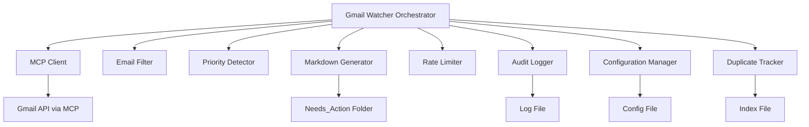
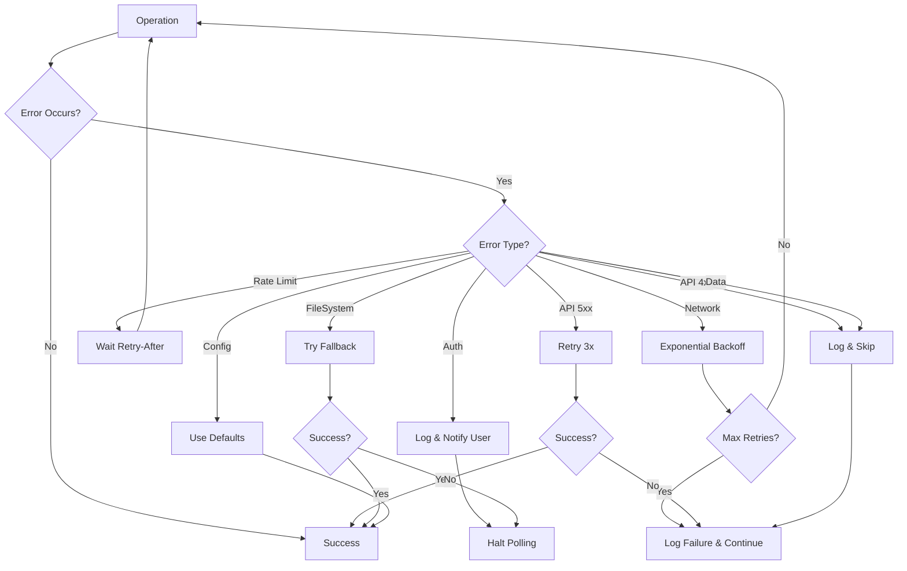

# Design Document: Gmail Watcher Agent Skill

## Overview

The Gmail Watcher Agent Skill is a monitoring component that integrates with Gmail via the Model Context Protocol (MCP) to detect important unread emails and create actionable markdown files in an Obsidian vault. The skill operates as part of the Ralph Loop architecture (Perception → Reasoning → Action) and provides automatic priority detection, robust error handling, and comprehensive audit logging.

The design follows a modular architecture with clear separation of concerns:
- **Email Polling**: Retrieves unread emails from Gmail via MCP
- **Filtering**: Evaluates emails against importance criteria
- **Priority Detection**: Assigns priority levels based on configurable rules
- **Markdown Generation**: Creates structured markdown files with frontmatter
- **Error Handling**: Manages API failures, rate limits, and network issues
- **Audit Logging**: Maintains a complete operation trail

The skill is designed to be resilient, idempotent, and configurable, ensuring reliable operation in a local-first environment.

## Architecture

### System Components



### Component Responsibilities

1. **Gmail Watcher Orchestrator**: Coordinates the polling cycle, manages component interactions, and handles the overall workflow
2. **MCP Client**: Handles all communication with Gmail API through the Model Context Protocol, including authentication and request/response handling
3. **Email Filter**: Evaluates emails against importance criteria (sender whitelist, keywords, labels)
4. **Priority Detector**: Assigns priority levels (high, medium, low) based on email characteristics
5. **Markdown Generator**: Creates markdown files with frontmatter and formatted content
6. **Rate Limiter**: Tracks API usage and implements exponential backoff strategies
7. **Audit Logger**: Records all operations, errors, and events to a persistent log file
8. **Configuration Manager**: Loads and validates configuration from YAML/JSON files
9. **Duplicate Tracker**: Maintains an index of processed emails to prevent duplicates

### Data Flow

1. **Polling Cycle Initiation**: Orchestrator triggers polling based on configured interval
2. **Email Retrieval**: MCP Client fetches unread emails from Gmail API
3. **Filtering**: Email Filter evaluates each email against importance criteria
4. **Priority Assignment**: Priority Detector assigns priority levels to important emails
5. **Duplicate Check**: Duplicate Tracker verifies email hasn't been processed
6. **Markdown Creation**: Markdown Generator creates file in Needs_Action folder
7. **Index Update**: Duplicate Tracker records processed email ID
8. **Audit Logging**: All operations logged throughout the process

### Error Handling Strategy

The system implements a layered error handling approach:

- **Transient Errors** (network timeouts, temporary API issues): Retry with exponential backoff
- **Rate Limit Errors**: Pause and resume after specified delay
- **Authentication Errors**: Log and notify user (requires manual intervention)
- **Data Errors** (malformed responses): Log and skip problematic item
- **Fatal Errors** (configuration missing, file system issues): Log and halt operation

## Components and Interfaces

### Gmail Watcher Orchestrator

**Purpose**: Coordinates the entire polling and processing workflow

**Interface**:
```typescript
interface GmailWatcherOrchestrator {
  start(): Promise<void>
  stop(): Promise<void>
  pollOnce(): Promise<PollResult>
}

interface PollResult {
  emailsProcessed: number
  emailsFiltered: number
  filesCreated: number
  errors: Error[]
}
```

**Key Methods**:
- `start()`: Begins the polling loop with configured interval
- `stop()`: Gracefully stops the polling loop
- `pollOnce()`: Executes a single polling cycle (useful for testing)

### MCP Client

**Purpose**: Handles all Gmail API communication via Model Context Protocol

**Interface**:
```typescript
interface MCPClient {
  authenticate(): Promise<AuthResult>
  fetchUnreadEmails(): Promise<Email[]>
  refreshToken(): Promise<void>
}

interface Email {
  id: string
  threadId: string
  sender: EmailAddress
  subject: string
  date: Date
  labels: string[]
  bodyHtml: string
  bodyText: string
}

interface EmailAddress {
  name: string
  email: string
}
```

**Key Methods**:
- `authenticate()`: Performs OAuth 2.0 authentication with Gmail
- `fetchUnreadEmails()`: Retrieves all unread emails from inbox
- `refreshToken()`: Refreshes expired authentication tokens

**Error Handling**:
- Throws `AuthenticationError` for auth failures
- Throws `NetworkError` for connectivity issues
- Throws `RateLimitError` for rate limit violations
- Throws `APIError` for other Gmail API errors

### Email Filter

**Purpose**: Evaluates emails against importance criteria

**Interface**:
```typescript
interface EmailFilter {
  isImportant(email: Email, criteria: ImportanceCriteria): boolean
}

interface ImportanceCriteria {
  senderWhitelist: string[]
  keywordPatterns: string[]
  requiredLabels: string[]
  logicMode: 'OR' | 'AND'
}
```

**Key Methods**:
- `isImportant()`: Returns true if email matches any importance criteria (OR logic)

**Filtering Logic**:
1. Check if sender email matches whitelist
2. Check if subject or body contains keyword patterns (case-insensitive)
3. Check if email has any required labels
4. Return true if any criterion matches (OR logic)

### Priority Detector

**Purpose**: Assigns priority levels to important emails

**Interface**:
```typescript
interface PriorityDetector {
  detectPriority(email: Email, rules: PriorityRules): PriorityLevel
}

type PriorityLevel = 'high' | 'medium' | 'low'

interface PriorityRules {
  highPriorityKeywords: string[]
  vipSenders: string[]
  highPriorityLabels: string[]
  mediumPriorityKeywords: string[]
}
```

**Key Methods**:
- `detectPriority()`: Analyzes email and returns priority level

**Priority Logic**:
1. **High Priority**: Email contains urgent keywords OR from VIP sender OR has high-priority labels
2. **Medium Priority**: Email contains medium-priority keywords OR doesn't match high criteria
3. **Low Priority**: Default when no other criteria match

### Markdown Generator

**Purpose**: Creates markdown files from email data

**Interface**:
```typescript
interface MarkdownGenerator {
  generateMarkdown(email: Email, priority: PriorityLevel): string
  createFile(markdown: string, filename: string, folder: string): Promise<void>
  htmlToMarkdown(html: string): string
}
```

**Key Methods**:
- `generateMarkdown()`: Creates markdown content with frontmatter
- `createFile()`: Writes markdown to file system
- `htmlToMarkdown()`: Converts HTML email bodies to markdown

**Markdown Format**:
```markdown
---
email_id: "abc123"
sender: "John Doe <john@example.com>"
subject: "Important Update"
date: "2024-01-15T10:30:00Z"
priority: "high"
labels: ["INBOX", "IMPORTANT"]
processed_at: "2024-01-15T10:35:00Z"
---

# Important Update

[Email body content in markdown format]
```

**Filename Generation**:
- Format: `YYYYMMDD_HHMMSS_sanitized-subject.md`
- Example: `20240115_103000_important-update.md`

### Rate Limiter

**Purpose**: Manages API request rates and implements backoff strategies

**Interface**:
```typescript
interface RateLimiter {
  checkLimit(): Promise<void>
  recordRequest(): void
  handleRateLimitError(retryAfter: number): Promise<void>
}

interface RateLimitConfig {
  maxRequestsPerMinute: number
  maxRequestsPerDay: number
  initialBackoffMs: number
  maxBackoffMs: number
  backoffMultiplier: number
}
```

**Key Methods**:
- `checkLimit()`: Blocks if rate limit would be exceeded
- `recordRequest()`: Increments request counter
- `handleRateLimitError()`: Implements exponential backoff

**Backoff Strategy**:
- Initial delay: 1 second
- Multiplier: 2x
- Maximum delay: 60 seconds
- Formula: `delay = min(initialDelay * (multiplier ^ attemptNumber), maxDelay)`

### Audit Logger

**Purpose**: Records all operations for traceability and debugging

**Interface**:
```typescript
interface AuditLogger {
  info(message: string, context?: object): void
  warn(message: string, context?: object): void
  error(message: string, error: Error, context?: object): void
}

interface LogEntry {
  timestamp: Date
  level: 'INFO' | 'WARN' | 'ERROR'
  message: string
  context?: object
  stackTrace?: string
}
```

**Key Methods**:
- `info()`: Logs informational messages
- `warn()`: Logs warning messages
- `error()`: Logs error messages with stack traces

**Log File Format**:
- JSON Lines format (one JSON object per line)
- Location: `.logs/gmail-watcher.log` in vault
- Rotation: Daily rotation with 30-day retention

### Configuration Manager

**Purpose**: Loads and validates configuration settings

**Interface**:
```typescript
interface ConfigurationManager {
  loadConfig(path: string): Promise<WatcherConfig>
  validateConfig(config: WatcherConfig): ValidationResult
  getDefaultConfig(): WatcherConfig
}

interface WatcherConfig {
  pollingIntervalMs: number
  importanceCriteria: ImportanceCriteria
  priorityRules: PriorityRules
  rateLimitConfig: RateLimitConfig
  needsActionFolder: string
  logFolder: string
}
```

**Key Methods**:
- `loadConfig()`: Reads and parses configuration file
- `validateConfig()`: Validates configuration structure and values
- `getDefaultConfig()`: Returns sensible default configuration

**Default Configuration**:
```yaml
pollingIntervalMs: 300000  # 5 minutes
importanceCriteria:
  senderWhitelist: []
  keywordPatterns: ["urgent", "important", "action required"]
  requiredLabels: ["IMPORTANT"]
  logicMode: "OR"
priorityRules:
  highPriorityKeywords: ["urgent", "asap", "critical", "emergency"]
  vipSenders: []
  highPriorityLabels: ["IMPORTANT", "STARRED"]
  mediumPriorityKeywords: ["follow up", "reminder", "deadline"]
rateLimitConfig:
  maxRequestsPerMinute: 60
  maxRequestsPerDay: 10000
  initialBackoffMs: 1000
  maxBackoffMs: 60000
  backoffMultiplier: 2
needsActionFolder: "Needs_Action"
logFolder: ".logs"
```

### Duplicate Tracker

**Purpose**: Prevents duplicate markdown file creation

**Interface**:
```typescript
interface DuplicateTracker {
  isProcessed(emailId: string): Promise<boolean>
  markProcessed(emailId: string, filename: string): Promise<void>
  rebuildIndex(folder: string): Promise<void>
}

interface ProcessedEmailIndex {
  [emailId: string]: {
    filename: string
    processedAt: Date
  }
}
```

**Key Methods**:
- `isProcessed()`: Checks if email ID exists in index
- `markProcessed()`: Adds email ID to index with metadata
- `rebuildIndex()`: Scans markdown files to rebuild index

**Index File Format**:
- JSON file: `.index/gmail-watcher-processed.json`
- Contains mapping of email IDs to filenames and timestamps

## Data Models

### Email Model

Represents an email retrieved from Gmail:

```typescript
interface Email {
  id: string                    // Gmail message ID (unique)
  threadId: string              // Gmail thread ID
  sender: EmailAddress          // Sender information
  subject: string               // Email subject line
  date: Date                    // Email sent date
  labels: string[]              // Gmail labels (e.g., "INBOX", "IMPORTANT")
  bodyHtml: string              // HTML body content
  bodyText: string              // Plain text body content
  snippet: string               // Email preview snippet
}

interface EmailAddress {
  name: string                  // Display name
  email: string                 // Email address
}
```

### Configuration Model

Represents the skill's configuration:

```typescript
interface WatcherConfig {
  pollingIntervalMs: number                 // Polling frequency in milliseconds
  importanceCriteria: ImportanceCriteria    // Email filtering rules
  priorityRules: PriorityRules              // Priority detection rules
  rateLimitConfig: RateLimitConfig          // Rate limiting settings
  needsActionFolder: string                 // Target folder for markdown files
  logFolder: string                         // Log file location
}

interface ImportanceCriteria {
  senderWhitelist: string[]     // Email addresses to always include
  keywordPatterns: string[]     // Keywords to match in subject/body
  requiredLabels: string[]      // Gmail labels to match
  logicMode: 'OR' | 'AND'       // How to combine criteria
}

interface PriorityRules {
  highPriorityKeywords: string[]    // Keywords indicating high priority
  vipSenders: string[]              // VIP email addresses
  highPriorityLabels: string[]      // Labels indicating high priority
  mediumPriorityKeywords: string[]  // Keywords indicating medium priority
}

interface RateLimitConfig {
  maxRequestsPerMinute: number      // Per-minute request limit
  maxRequestsPerDay: number         // Per-day request limit
  initialBackoffMs: number          // Initial backoff delay
  maxBackoffMs: number              // Maximum backoff delay
  backoffMultiplier: number         // Backoff multiplier
}
```

### Processed Email Index Model

Tracks processed emails to prevent duplicates:

```typescript
interface ProcessedEmailIndex {
  [emailId: string]: ProcessedEmailEntry
}

interface ProcessedEmailEntry {
  filename: string              // Generated markdown filename
  processedAt: Date             // When email was processed
  priority: PriorityLevel       // Assigned priority level
}
```

### Log Entry Model

Represents a single log entry:

```typescript
interface LogEntry {
  timestamp: Date               // When log entry was created
  level: LogLevel               // Log severity level
  message: string               // Log message
  context?: object              // Additional context data
  stackTrace?: string           // Error stack trace (for errors)
}

type LogLevel = 'INFO' | 'WARN' | 'ERROR'
```

### Error Models

Custom error types for different failure scenarios:

```typescript
class AuthenticationError extends Error {
  constructor(message: string, public originalError?: Error) {
    super(message)
    this.name = 'AuthenticationError'
  }
}

class NetworkError extends Error {
  constructor(message: string, public originalError?: Error) {
    super(message)
    this.name = 'NetworkError'
  }
}

class RateLimitError extends Error {
  constructor(
    message: string,
    public retryAfter: number,
    public originalError?: Error
  ) {
    super(message)
    this.name = 'RateLimitError'
  }
}

class APIError extends Error {
  constructor(
    message: string,
    public statusCode: number,
    public originalError?: Error
  ) {
    super(message)
    this.name = 'APIError'
  }
}

class ConfigurationError extends Error {
  constructor(message: string, public validationErrors?: string[]) {
    super(message)
    this.name = 'ConfigurationError'
  }
}
```


## Correctness Properties

*A property is a characteristic or behavior that should hold true across all valid executions of a system—essentially, a formal statement about what the system should do. Properties serve as the bridge between human-readable specifications and machine-verifiable correctness guarantees.*

### Property 1: Complete Email Retrieval

*For any* inbox state with unread emails, when the Gmail_Watcher polls the Gmail API, all unread emails should be retrieved and none should be missed.

**Validates: Requirements 1.1**

### Property 2: Complete Metadata Extraction

*For any* email returned by the Gmail API, the extracted email object should contain all required metadata fields: sender (name and email), subject, date, labels, and body content (both HTML and text).

**Validates: Requirements 1.3**

### Property 3: Email Filter Criteria Evaluation

*For any* email and importance criteria configuration, the Email_Filter should correctly evaluate whether the email matches any criterion (sender whitelist, keyword patterns, or required labels) using OR logic.

**Validates: Requirements 2.1, 2.2, 2.3, 2.4, 2.6**

### Property 4: Non-Important Email Exclusion

*For any* email that does not match any importance criteria, the Email_Filter should exclude it from further processing, and no markdown file should be created for it.

**Validates: Requirements 2.5**

### Property 5: Priority Level Assignment

*For any* important email, the Priority_Detector should assign exactly one priority level (high, medium, or low), and the assignment should be deterministic given the same email and priority rules.

**Validates: Requirements 3.1**

### Property 6: High Priority Detection

*For any* email that contains urgent keywords OR is from a VIP sender OR has high-priority labels, the Priority_Detector should assign high priority.

**Validates: Requirements 3.2, 3.3, 3.4**

### Property 7: Default Priority Assignment

*For any* email without high-priority indicators, the Priority_Detector should assign either medium or low priority based on secondary criteria, never leaving priority unassigned.

**Validates: Requirements 3.5**

### Property 8: Markdown File Creation

*For any* important email that is not a duplicate, the Markdown_Generator should create exactly one markdown file in the Needs_Action_Folder.

**Validates: Requirements 4.1**

### Property 9: Complete Markdown Content

*For any* markdown file created from an email, the file should contain complete frontmatter (email_id, sender, subject, date, priority, labels, processed_at) and the email body content in markdown format.

**Validates: Requirements 4.2, 4.3**

### Property 10: Unique Filename Generation

*For any* two different emails processed at different times, the generated markdown filenames should be unique and follow the format `YYYYMMDD_HHMMSS_sanitized-subject.md`.

**Validates: Requirements 4.4**

### Property 11: HTML to Markdown Conversion Preservation

*For any* email with HTML content, converting the HTML to markdown and then rendering it should preserve the essential content structure (headings, paragraphs, lists, links).

**Validates: Requirements 4.5**

### Property 12: Idempotent Email Processing

*For any* email, processing it multiple times should result in exactly one markdown file being created, with subsequent processing attempts being skipped and logged.

**Validates: Requirements 4.6, 10.3**

### Property 13: Network Error Retry with Backoff

*For any* network timeout error, the Gmail_Watcher should retry the request with exponential backoff, where each retry delay is double the previous delay (starting at 1 second) up to a maximum of 60 seconds.

**Validates: Requirements 5.2, 6.3, 6.4**

### Property 14: Malformed Data Handling

*For any* malformed API response, the Gmail_Watcher should log the error, skip the problematic email, and continue processing remaining emails without crashing.

**Validates: Requirements 5.5**

### Property 15: Comprehensive Error Logging

*For any* error that occurs during operation, the Audit_Logger should record a log entry containing the error type, message, timestamp, context, and stack trace (for exceptions).

**Validates: Requirements 5.6, 7.4**

### Property 16: Request Count Tracking

*For any* sequence of API requests, the Rate_Limiter should accurately track the count of requests made within each time window (per-minute and per-day).

**Validates: Requirements 6.1**

### Property 17: Operation Logging Completeness

*For any* important email detected and processed, the Audit_Logger should create log entries for: email detection (with metadata and priority), markdown file creation (with file path and email ID), and any errors encountered.

**Validates: Requirements 7.2, 7.3**

### Property 18: Log Entry Structure

*For any* log entry created, it should contain a timestamp, log level (INFO, WARN, or ERROR), message, and optional context object.

**Validates: Requirements 7.7**

### Property 19: Configuration Application

*For any* valid configuration file, the Gmail_Watcher should apply all configured settings: importance criteria should be used by Email_Filter, priority rules should be used by Priority_Detector, and rate limit thresholds should be enforced by Rate_Limiter.

**Validates: Requirements 8.3, 8.4, 8.5**

### Property 20: MCP Protocol Request Format

*For any* API request made by the MCP_Client, the request should conform to the MCP protocol format with proper structure, headers, and authentication.

**Validates: Requirements 9.2**

### Property 21: MCP Protocol Response Parsing

*For any* valid MCP protocol response, the MCP_Client should successfully parse it into the internal Email data model without data loss.

**Validates: Requirements 9.3**

### Property 22: MCP Error Code Translation

*For any* MCP-specific error code received, the MCP_Client should translate it to the appropriate internal error type (AuthenticationError, NetworkError, RateLimitError, or APIError).

**Validates: Requirements 9.5**

### Property 23: Duplicate Detection by Gmail ID

*For any* email with a Gmail ID that exists in the processed email index, the Gmail_Watcher should detect it as a duplicate and skip processing.

**Validates: Requirements 10.1, 10.2**

## Error Handling

### Error Categories and Responses

The system handles errors in distinct categories with appropriate recovery strategies:

**1. Authentication Errors**
- **Cause**: Invalid OAuth tokens, expired credentials, insufficient permissions
- **Response**: Log error with details, notify user via log file, halt polling until resolved
- **Recovery**: Requires manual user intervention to re-authenticate
- **Example**: `AuthenticationError: OAuth token expired or invalid`

**2. Network Errors**
- **Cause**: Connection timeouts, DNS failures, network unavailability
- **Response**: Retry with exponential backoff (1s, 2s, 4s, 8s, 16s, 32s, 60s max)
- **Recovery**: Automatic retry up to 7 attempts, then log failure and continue to next polling cycle
- **Example**: `NetworkError: Connection timeout after 30 seconds`

**3. Rate Limit Errors**
- **Cause**: Exceeding Gmail API quota limits
- **Response**: Pause all requests, wait for retry-after duration, resume polling
- **Recovery**: Automatic - respect rate limit headers and resume after specified delay
- **Example**: `RateLimitError: Rate limit exceeded, retry after 60 seconds`

**4. API Errors (4xx/5xx)**
- **Cause**: Invalid requests, server errors, service unavailability
- **Response**: 
  - 4xx (client errors): Log error, skip problematic request, continue
  - 5xx (server errors): Retry up to 3 times with backoff, then log failure
- **Recovery**: Automatic retry for 5xx, skip and continue for 4xx
- **Example**: `APIError: Gmail API returned 503 Service Unavailable`

**5. Data Validation Errors**
- **Cause**: Malformed API responses, missing required fields, invalid data types
- **Response**: Log error with response details, skip problematic email, continue processing
- **Recovery**: Automatic - skip bad data and process remaining emails
- **Example**: `ValidationError: Email missing required field 'sender'`

**6. File System Errors**
- **Cause**: Permission issues, disk full, invalid paths
- **Response**: Log error, attempt to create in fallback location, notify user if critical
- **Recovery**: Attempt fallback strategies, halt if unable to write logs
- **Example**: `FileSystemError: Unable to write to Needs_Action folder`

**7. Configuration Errors**
- **Cause**: Missing config file, invalid YAML/JSON, invalid values
- **Response**: Log warning, use default configuration values, continue operation
- **Recovery**: Automatic - fall back to sensible defaults
- **Example**: `ConfigurationError: Invalid polling interval, using default 300000ms`

### Error Handling Workflow



### Error Logging Requirements

All errors must be logged with:
- **Timestamp**: ISO 8601 format with timezone
- **Error Type**: Specific error class name
- **Message**: Human-readable description
- **Context**: Relevant operation details (email ID, file path, etc.)
- **Stack Trace**: Full stack trace for debugging (ERROR level only)
- **Recovery Action**: What the system did in response

### Graceful Degradation

The system prioritizes continued operation over perfection:
- **Single email failure**: Skip and continue processing remaining emails
- **Single polling cycle failure**: Log and wait for next cycle
- **Persistent failures**: Continue attempting with backoff, log patterns for user review
- **Critical failures**: Halt only when unable to log or access configuration

## Testing Strategy

### Dual Testing Approach

The Gmail Watcher Agent Skill requires both unit testing and property-based testing for comprehensive coverage:

**Unit Tests** focus on:
- Specific examples demonstrating correct behavior
- Edge cases (empty inbox, missing fields, malformed data)
- Error conditions (authentication failures, network timeouts)
- Integration points between components
- Configuration loading and validation

**Property Tests** focus on:
- Universal properties that hold for all inputs
- Comprehensive input coverage through randomization
- Invariants that must be maintained
- Round-trip properties (HTML to markdown conversion)
- Idempotency guarantees

### Property-Based Testing Configuration

**Testing Library**: Use `fast-check` for TypeScript/JavaScript implementation

**Test Configuration**:
- Minimum 100 iterations per property test (due to randomization)
- Each property test must reference its design document property
- Tag format: `Feature: gmail-watcher-skill, Property {number}: {property_text}`

**Example Property Test Structure**:
```typescript
import fc from 'fast-check'

// Feature: gmail-watcher-skill, Property 3: Email Filter Criteria Evaluation
test('Email filter correctly evaluates importance criteria with OR logic', () => {
  fc.assert(
    fc.property(
      emailArbitrary(),
      importanceCriteriaArbitrary(),
      (email, criteria) => {
        const result = emailFilter.isImportant(email, criteria)
        const matchesSender = criteria.senderWhitelist.includes(email.sender.email)
        const matchesKeyword = criteria.keywordPatterns.some(kw => 
          email.subject.toLowerCase().includes(kw.toLowerCase()) ||
          email.bodyText.toLowerCase().includes(kw.toLowerCase())
        )
        const matchesLabel = criteria.requiredLabels.some(label =>
          email.labels.includes(label)
        )
        const expected = matchesSender || matchesKeyword || matchesLabel
        expect(result).toBe(expected)
      }
    ),
    { numRuns: 100 }
  )
})
```

### Test Coverage Requirements

**Unit Test Coverage**:
1. Configuration loading (valid, missing, malformed)
2. Authentication error handling
3. Rate limit error handling with specific retry-after values
4. Server error retry logic (exactly 3 attempts)
5. Empty inbox handling
6. Duplicate detection with existing index
7. Index rebuild from markdown files
8. Filename generation edge cases (special characters, very long subjects)
9. Log file writing and rotation
10. Default configuration values

**Property Test Coverage** (one test per property):
1. Complete email retrieval (Property 1)
2. Complete metadata extraction (Property 2)
3. Email filter criteria evaluation (Property 3)
4. Non-important email exclusion (Property 4)
5. Priority level assignment (Property 5)
6. High priority detection (Property 6)
7. Default priority assignment (Property 7)
8. Markdown file creation (Property 8)
9. Complete markdown content (Property 9)
10. Unique filename generation (Property 10)
11. HTML to markdown conversion preservation (Property 11)
12. Idempotent email processing (Property 12)
13. Network error retry with backoff (Property 13)
14. Malformed data handling (Property 14)
15. Comprehensive error logging (Property 15)
16. Request count tracking (Property 16)
17. Operation logging completeness (Property 17)
18. Log entry structure (Property 18)
19. Configuration application (Property 19)
20. MCP protocol request format (Property 20)
21. MCP protocol response parsing (Property 21)
22. MCP error code translation (Property 22)
23. Duplicate detection by Gmail ID (Property 23)

### Test Data Generators (Arbitraries)

Property tests require generators for random test data:

```typescript
// Email generator
const emailArbitrary = () => fc.record({
  id: fc.uuid(),
  threadId: fc.uuid(),
  sender: fc.record({
    name: fc.string(),
    email: fc.emailAddress()
  }),
  subject: fc.string({ minLength: 1, maxLength: 200 }),
  date: fc.date(),
  labels: fc.array(fc.string(), { minLength: 0, maxLength: 10 }),
  bodyHtml: fc.string(),
  bodyText: fc.string(),
  snippet: fc.string({ maxLength: 100 })
})

// Importance criteria generator
const importanceCriteriaArbitrary = () => fc.record({
  senderWhitelist: fc.array(fc.emailAddress()),
  keywordPatterns: fc.array(fc.string()),
  requiredLabels: fc.array(fc.string()),
  logicMode: fc.constantFrom('OR', 'AND')
})

// Priority rules generator
const priorityRulesArbitrary = () => fc.record({
  highPriorityKeywords: fc.array(fc.string()),
  vipSenders: fc.array(fc.emailAddress()),
  highPriorityLabels: fc.array(fc.string()),
  mediumPriorityKeywords: fc.array(fc.string())
})
```

### Integration Testing

While unit and property tests cover individual components, integration tests verify end-to-end workflows:

1. **Full Polling Cycle**: Mock Gmail API → Poll → Filter → Prioritize → Generate Markdown → Verify File
2. **Error Recovery**: Inject network error → Verify retry → Verify success after retry
3. **Rate Limit Handling**: Inject rate limit error → Verify pause → Verify resume
4. **Duplicate Prevention**: Process same email twice → Verify single file created
5. **Configuration Changes**: Update config → Verify new rules applied

### Mocking Strategy

**Mock Gmail API**: Create test doubles for MCP_Client that return controlled responses
**Mock File System**: Use in-memory file system for faster tests
**Mock Time**: Control time for testing polling intervals and backoff delays
**Mock Logger**: Capture log entries for verification

### Test Execution

**Local Development**:
```bash
npm test                    # Run all tests
npm test:unit              # Run unit tests only
npm test:property          # Run property tests only
npm test:integration       # Run integration tests
npm test:coverage          # Generate coverage report
```

**CI/CD Pipeline**:
- Run all tests on every commit
- Require 80% code coverage minimum
- Run property tests with 1000 iterations in CI (more thorough)
- Fail build on any test failure

### Performance Testing

While not part of unit/property testing, performance characteristics should be validated:
- **Polling cycle time**: Should complete within 30 seconds for 100 emails
- **Memory usage**: Should remain stable over 24-hour operation
- **Rate limit compliance**: Should never exceed configured limits
- **File I/O**: Should handle 1000+ markdown files without degradation
