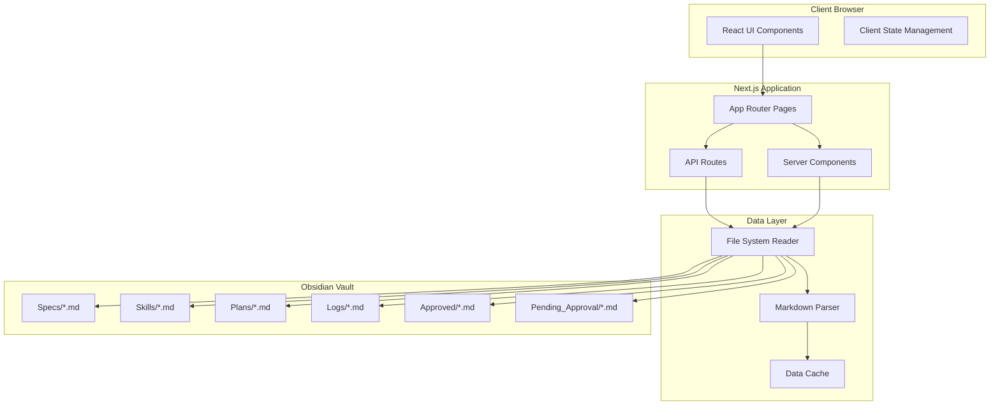

# Design Document: Next.js Dashboard UI

## Overview

The Next.js Dashboard UI is a web-based application that provides real-time visualization and interaction with the AI Employee system's Obsidian vault. Built with Next.js 14+ using the App Router, TypeScript, and React Server Components, the dashboard reads markdown files from the file system, parses frontmatter metadata, and presents structured information through an intuitive interface.

The architecture follows a layered approach:
- **Data Layer**: File system access and markdown parsing
- **Service Layer**: Business logic for aggregating metrics and organizing data
- **Presentation Layer**: React components for visualization
- **API Layer**: Next.js API routes for data fetching and caching

The dashboard operates in read-only mode, focusing on visualization and monitoring rather than editing vault content. This design decision ensures data integrity and simplifies the implementation by avoiding complex file write operations and conflict resolution.

## Architecture

### System Architecture



### Technology Stack

- **Framework**: Next.js 14+ (App Router)
- **Language**: TypeScript
- **UI Library**: React 18+
- **Styling**: Tailwind CSS or CSS Modules
- **Markdown Parsing**: gray-matter (frontmatter), remark/unified (content)
- **Charts**: Recharts or Chart.js
- **File Watching**: chokidar (optional for live updates)
- **Caching**: Node.js in-memory cache or Redis (for production)

### Deployment Considerations

- **Development**: Local Next.js dev server with direct file system access
- **Production**: Deployed as a Node.js application (not static export) to maintain file system access
- **Vault Access**: Vault directory must be accessible to the Node.js process (local file system or mounted volume)

## Components and Interfaces

### Core Data Types

```typescript
// Frontmatter metadata structure
interface VaultMetadata {
  title?: string;
  status?: 'draft' | 'pending' | 'approved' | 'done' | 'needs_action';
  created?: string;
  modified?: string;
  priority?: 'high' | 'medium' | 'low';
  type?: 'spec' | 'skill' | 'plan' | 'log';
  tags?: string[];
  [key: string]: any; // Allow additional custom fields
}

// Parsed markdown file
interface VaultFile {
  path: string;
  filename: string;
  folder: string;
  metadata: VaultMetadata;
  content: string;
  rawContent: string;
}

// Aggregated metrics
interface SystemMetrics {
  totalSpecs: number;
  totalSkills: number;
  totalPlans: number;
  totalLogs: number;
  specsByStatus: Record<string, number>;
  recentActivity: ActivityEntry[];
  emailStats: EmailMetrics;
}

interface ActivityEntry {
  timestamp: string;
  action: string;
  description: string;
  file?: string;
}

interface EmailMetrics {
  totalProcessed: number;
  byPriority: Record<string, number>;
  successRate: number;
  recentVolume: Array<{ date: string; count: number }>;
}
```

### File System Reader

```typescript
class VaultReader {
  constructor(vaultPath: string);
  
  // Read all markdown files from vault
  async readAllFiles(): Promise<VaultFile[]>;
  
  // Read files from specific folder
  async readFolder(folderPath: string): Promise<VaultFile[]>;
  
  // Read single file
  async readFile(filePath: string): Promise<VaultFile>;
  
  // Get vault directory structure
  async getDirectoryTree(): Promise<DirectoryNode>;
}
```

### Markdown Parser

```typescript
class MarkdownParser {
  // Parse markdown file with frontmatter
  parse(content: string): { metadata: VaultMetadata; content: string };
  
  // Convert markdown to HTML
  toHTML(markdown: string): Promise<string>;
  
  // Extract plain text from markdown
  toPlainText(markdown: string): string;
}
```

### Metrics Aggregator

```typescript
class MetricsAggregator {
  constructor(files: VaultFile[]);
  
  // Calculate system-wide metrics
  calculateMetrics(): SystemMetrics;
  
  // Get specs grouped by status
  getSpecsByStatus(): Record<string, VaultFile[]>;
  
  // Get recent activity from logs
  getRecentActivity(days: number): ActivityEntry[];
  
  // Calculate email processing metrics
  getEmailMetrics(): EmailMetrics;
  
  // Get skill usage statistics
  getSkillStats(): Array<{ skill: string; usageCount: number }>;
}
```

### Data Cache

```typescript
class DataCache {
  // Cache parsed vault data
  set(key: string, data: any, ttl?: number): void;
  
  // Retrieve cached data
  get<T>(key: string): T | null;
  
  // Invalidate cache
  invalidate(key: string): void;
  
  // Clear all cache
  clear(): void;
}
```

### File Watcher (Optional)

```typescript
class VaultWatcher {
  constructor(vaultPath: string, onChange: () => void);
  
  // Start watching for file changes
  start(): void;
  
  // Stop watching
  stop(): void;
  
  // Get list of changed files since last check
  getChangedFiles(): string[];
}
```

## Data Models

### Vault Organization

The dashboard reads from the following vault structure:

```
vault/
├── Specs/              # Feature specifications
├── Skills/             # Reusable AI capabilities
├── Plans/              # Execution plans
├── Approved/           # Approved specs
├── Pending_Approval/   # Specs awaiting approval
├── Needs_Action/       # Specs requiring action
├── Done/               # Completed specs
├── Logs/               # System activity logs
└── Dashboard/          # Dashboard configuration
```

### Frontmatter Schema

Each markdown file contains YAML frontmatter with metadata:

```yaml
---
title: "Feature Name"
status: "pending"
created: "2024-01-15"
modified: "2024-01-20"
priority: "high"
type: "spec"
tags: ["ai", "automation"]
---
```

### Data Flow

1. **Initial Load**: VaultReader scans all folders and reads markdown files
2. **Parsing**: MarkdownParser extracts frontmatter and content from each file
3. **Aggregation**: MetricsAggregator processes files to calculate metrics
4. **Caching**: Parsed data is cached to improve performance
5. **Rendering**: React components receive data and render UI
6. **Refresh**: Manual refresh or file watcher triggers re-reading and cache invalidation

## API Routes

### GET /api/vault/metrics

Returns aggregated system metrics.

**Response:**
```json
{
  "totalSpecs": 45,
  "totalSkills": 12,
  "totalPlans": 38,
  "totalLogs": 156,
  "specsByStatus": {
    "draft": 5,
    "pending": 8,
    "approved": 20,
    "done": 12
  },
  "recentActivity": [...],
  "emailStats": {...}
}
```

### GET /api/vault/specs

Returns all specs with optional filtering.

**Query Parameters:**
- `status`: Filter by status
- `search`: Search term
- `folder`: Filter by folder

**Response:**
```json
{
  "specs": [
    {
      "path": "Specs/feature-name.md",
      "filename": "feature-name.md",
      "folder": "Specs",
      "metadata": {...},
      "content": "..."
    }
  ],
  "total": 45
}
```

### GET /api/vault/specs/[id]

Returns a single spec by file path (encoded).

**Response:**
```json
{
  "path": "Specs/feature-name.md",
  "filename": "feature-name.md",
  "folder": "Specs",
  "metadata": {...},
  "content": "...",
  "rawContent": "..."
}
```

### GET /api/vault/skills

Returns all skills from the Skills folder.

**Response:**
```json
{
  "skills": [...],
  "total": 12
}
```

### GET /api/vault/logs

Returns recent log entries.

**Query Parameters:**
- `limit`: Number of entries (default: 50)
- `offset`: Pagination offset
- `days`: Filter by days (e.g., last 7 days)

**Response:**
```json
{
  "logs": [...],
  "total": 156,
  "hasMore": true
}
```

### POST /api/vault/refresh

Triggers manual cache invalidation and data refresh.

**Response:**
```json
{
  "success": true,
  "message": "Cache refreshed",
  "timestamp": "2024-01-20T10:30:00Z"
}
```

## UI Component Structure

### Page Layout

```
┌─────────────────────────────────────────┐
│  Header (Logo, Title, Refresh Button)  │
├──────────┬──────────────────────────────┤
│          │                              │
│  Sidebar │  Main Content Area           │
│  Nav     │                              │
│          │  - Dashboard Overview        │
│  - Home  │  - Specs Browser             │
│  - Specs │  - Skills Library            │
│  - Skills│  - Activity Timeline         │
│  - Logs  │  - Approval Queue            │
│  - Queue │                              │
│          │                              │
└──────────┴──────────────────────────────┘
```

### Key Components

**DashboardOverview**: Displays metric cards, charts, and recent activity summary

**SpecsBrowser**: Lists specs with filtering, search, and status grouping

**SpecDetail**: Shows full spec content with metadata and navigation

**SkillsLibrary**: Displays skills with search and usage statistics

**ActivityTimeline**: Shows chronological log entries with filtering

**ApprovalQueue**: Lists pending approvals with priority sorting

**MetricCard**: Reusable component for displaying single metrics

**SearchBar**: Global search component with autocomplete

**FilterPanel**: Sidebar for applying multiple filters

**RefreshButton**: Triggers manual data refresh

## Error Handling

### Error Categories

1. **File System Errors**: File not found, permission denied, disk errors
2. **Parsing Errors**: Invalid YAML frontmatter, malformed markdown
3. **Configuration Errors**: Missing vault path, invalid configuration
4. **Network Errors**: API route failures (in production deployments)

### Error Handling Strategy

```typescript
// Graceful degradation for file read errors
try {
  const file = await vaultReader.readFile(path);
  return file;
} catch (error) {
  logger.error(`Failed to read file: ${path}`, error);
  return null; // Continue processing other files
}

// User-friendly error messages
if (!vaultPath) {
  return (
    <ErrorMessage 
      title="Configuration Error"
      message="Vault path not configured. Please set VAULT_PATH environment variable."
      action={<SetupWizard />}
    />
  );
}

// Parsing error handling
try {
  const parsed = parser.parse(content);
  return parsed;
} catch (error) {
  logger.warn(`Failed to parse frontmatter: ${path}`, error);
  return { metadata: {}, content }; // Return content without metadata
}
```

### Loading States

- Display skeleton loaders while data is being fetched
- Show progress indicators for long-running operations
- Provide "retry" buttons for failed operations
- Cache data to minimize loading times on subsequent visits

## Testing Strategy

The testing strategy employs both unit tests and property-based tests to ensure comprehensive coverage.

### Unit Testing

Unit tests focus on specific examples, edge cases, and integration points:

- **File System Operations**: Test reading files, handling missing files, permission errors
- **Markdown Parsing**: Test valid frontmatter, invalid YAML, missing frontmatter, special characters
- **Metrics Calculation**: Test aggregation logic with known datasets
- **API Routes**: Test request/response handling, query parameters, error responses
- **UI Components**: Test rendering, user interactions, conditional display
- **Error Handling**: Test error boundaries, fallback UI, error messages

### Property-Based Testing

Property-based tests verify universal properties across randomized inputs. Each test should run a minimum of 100 iterations and be tagged with the corresponding design property.

**Property-Based Testing Library**: Use `fast-check` for TypeScript/JavaScript property-based testing.

**Test Configuration**:
```typescript
import fc from 'fast-check';

// Example property test
fc.assert(
  fc.property(
    fc.string(), // arbitrary string input
    (input) => {
      // Test property
    }
  ),
  { numRuns: 100 } // Minimum 100 iterations
);
```

**Test Tagging Format**:
```typescript
// Feature: nextjs-dashboard-ui, Property 1: Parsing round trip
test('markdown parsing preserves content', () => {
  // Property test implementation
});
```


## Correctness Properties

A property is a characteristic or behavior that should hold true across all valid executions of a system—essentially, a formal statement about what the system should do. Properties serve as the bridge between human-readable specifications and machine-verifiable correctness guarantees.

### Property 1: Complete file discovery

*For any* vault directory structure with nested subdirectories containing markdown files, the File_Reader should discover and load all .md files regardless of nesting depth.

**Validates: Requirements 1.1, 1.4**

### Property 2: Extension filtering

*For any* directory containing files with various extensions, the File_Reader should return only files with .md extension and exclude all other file types.

**Validates: Requirements 1.5**

### Property 3: Error resilience

*For any* vault containing a mix of readable and unreadable files, the File_Reader should log errors for unreadable files and successfully process all readable files without stopping.

**Validates: Requirements 1.3**

### Property 4: Frontmatter extraction

*For any* markdown file with valid YAML frontmatter, the Parser should extract the frontmatter as structured metadata separate from the content body.

**Validates: Requirements 2.1, 2.5**

### Property 5: Content extraction

*For any* markdown file, the Parser should extract the content body (everything after frontmatter) as a separate field from metadata.

**Validates: Requirements 2.2, 2.5**

### Property 6: Graceful parsing failure

*For any* markdown file with invalid or missing frontmatter, the Parser should return empty metadata and the full file content without throwing errors.

**Validates: Requirements 2.3**

### Property 7: Accurate metric calculation

*For any* collection of vault files with metadata, the MetricsAggregator should calculate counts (total specs, skills, plans, logs, specs by status) that exactly match the actual file counts when grouped by type and status.

**Validates: Requirements 3.1, 3.2, 5.1, 5.2, 6.5**

### Property 8: Date-based activity filtering

*For any* collection of log entries with timestamps, filtering by "last N days" should return only entries with timestamps within that date range.

**Validates: Requirements 3.3**

### Property 9: Reactive metric updates

*For any* vault data change, the Overview_Component should recalculate and display updated metrics reflecting the new state.

**Validates: Requirements 3.4**

### Property 10: Folder-based grouping

*For any* collection of specs in different folders, the Spec_Browser should group them by folder name with all specs from the same folder appearing together.

**Validates: Requirements 4.1**

### Property 11: Required metadata rendering

*For any* vault file (spec, skill, log), when rendered in a list view, the display should include all required fields from frontmatter (title, status, dates, priority) if they exist in the metadata.

**Validates: Requirements 4.2, 6.2, 7.2, 8.2**

### Property 12: Multi-criteria filtering

*For any* collection of specs and any combination of filter criteria (status, date range, search term), the filtered results should include only specs that match all applied criteria.

**Validates: Requirements 4.4, 11.3, 11.4**

### Property 13: Email metrics aggregation

*For any* collection of email log entries, the calculated success rate should equal (successful emails / total emails) and priority grouping should correctly count emails by priority level.

**Validates: Requirements 5.3**

### Property 14: Time-series aggregation

*For any* collection of timestamped email entries, grouping by time period (day, week) should produce counts where the sum of all period counts equals the total number of emails.

**Validates: Requirements 5.4**

### Property 15: Folder filtering

*For any* vault containing files in multiple folders, filtering by a specific folder (e.g., "Pending_Approval", "Skills") should return only files whose path includes that folder.

**Validates: Requirements 6.1, 8.1**

### Property 16: Priority and date sorting

*For any* collection of pending approval items with priority and date metadata, sorting by priority then date should result in high-priority items first, then medium, then low, with ties broken by date (newest first).

**Validates: Requirements 6.3**

### Property 17: Chronological log ordering

*For any* collection of log entries with timestamps, displaying them in chronological order should result in entries sorted by timestamp with the most recent first.

**Validates: Requirements 7.1**

### Property 18: Log filtering

*For any* collection of log entries, filtering by date range or action type should return only entries that match the filter criteria.

**Validates: Requirements 7.3**

### Property 19: Incremental pagination

*For any* collection of log entries larger than the page size, requesting the next page should return the next batch of entries without duplicating or skipping any entries.

**Validates: Requirements 7.5**

### Property 20: Multi-field search

*For any* collection of vault files and any search term, the search should match files where the term appears in the filename, title metadata, or content body.

**Validates: Requirements 11.1, 11.2**

### Property 21: Filter clearing

*For any* filtered view of vault data, clearing all filters should restore the complete unfiltered dataset.

**Validates: Requirements 11.5**

### Property 22: Navigation state preservation

*For any* application state (search terms, filters, scroll position), navigating to a different page and returning should preserve the state where appropriate (e.g., search terms persist, scroll position resets).

**Validates: Requirements 9.4**

### Property 23: Responsive layout adaptation

*For any* viewport width, the Dashboard should render without horizontal scrolling and adapt component layouts to fit the available width.

**Validates: Requirements 10.5**

### Property 24: Data refresh triggers UI update

*For any* vault data state, triggering a refresh (manual or file watcher) should result in the UI displaying the updated data after the refresh completes.

**Validates: Requirements 12.3, 12.4, 12.5**

### Property 25: File watcher change detection

*For any* file system change in the watched vault directory (file added, modified, deleted), the File_Watcher should detect the change and trigger the onChange callback.

**Validates: Requirements 12.4**

### Property 26: Parsing error isolation

*For any* collection of vault files where some have parsing errors, the Dashboard should successfully display files that parse correctly while logging errors for failed files.

**Validates: Requirements 13.2**

### Property 27: Cache hit avoids re-parsing

*For any* cached vault data, subsequent requests for the same data should return the cached version without re-reading or re-parsing files until cache is invalidated.

**Validates: Requirements 14.1**

### Property 28: Lazy loading defers off-screen content

*For any* list of items where some are off-screen, only visible items should be initially loaded, with off-screen items loaded when they become visible.

**Validates: Requirements 14.3**

### Property 29: Configuration hot-reload

*For any* configuration change (vault path, refresh interval, display preferences), applying the new configuration should update system behavior without requiring an application restart.

**Validates: Requirements 15.5**

### Property 30: Skill usage statistics

*For any* collection of skills with usage count metadata, displaying skills sorted by usage should show the most frequently used skills first.

**Validates: Requirements 8.5**


## Testing Strategy

The testing strategy employs a dual approach combining unit tests for specific scenarios and property-based tests for universal correctness guarantees.

### Unit Testing Approach

Unit tests focus on:

1. **Specific Examples**: Concrete test cases that demonstrate correct behavior
   - Loading a vault with known structure and verifying expected files are found
   - Parsing a specific markdown file with known frontmatter and content
   - Calculating metrics for a known dataset and verifying exact values

2. **Edge Cases**: Boundary conditions and special scenarios
   - Empty vault directory
   - Markdown file with no frontmatter
   - Markdown file with only frontmatter and no content
   - Files with special characters in names or content
   - Very deeply nested directory structures (10+ levels)
   - Large files (>1MB markdown content)

3. **Error Conditions**: Failure scenarios and error handling
   - File permission denied
   - Malformed YAML in frontmatter
   - Missing vault directory
   - Disk read errors
   - Invalid configuration

4. **Integration Points**: Component interactions
   - VaultReader → MarkdownParser → MetricsAggregator pipeline
   - API routes calling service layer
   - React components receiving and rendering data
   - Cache invalidation triggering data refresh

5. **UI Interactions**: User-triggered behaviors
   - Clicking navigation links navigates to correct pages
   - Clicking refresh button triggers data reload
   - Clicking a spec opens detail view
   - Applying filters updates displayed results
   - Clearing search restores full list

### Property-Based Testing Approach

Property-based tests verify universal properties using the `fast-check` library for TypeScript. Each property test should:

- Run a minimum of 100 iterations with randomized inputs
- Be tagged with a comment referencing the design property
- Use appropriate generators for input data (strings, numbers, objects, arrays)
- Assert the property holds for all generated inputs

**Test Configuration Example**:

```typescript
import fc from 'fast-check';

// Feature: nextjs-dashboard-ui, Property 2: Extension filtering
describe('VaultReader file filtering', () => {
  test('should return only .md files regardless of other files present', () => {
    fc.assert(
      fc.property(
        fc.array(fc.record({
          name: fc.string(),
          extension: fc.oneof(fc.constant('.md'), fc.constant('.txt'), fc.constant('.pdf'), fc.constant('.json'))
        })),
        (files) => {
          // Create test directory with generated files
          const testDir = createTestDirectory(files);
          const reader = new VaultReader(testDir);
          const result = reader.readAllFiles();
          
          // Property: all returned files should have .md extension
          const allMarkdown = result.every(file => file.filename.endsWith('.md'));
          expect(allMarkdown).toBe(true);
          
          // Property: count should match number of .md files in input
          const expectedCount = files.filter(f => f.extension === '.md').length;
          expect(result.length).toBe(expectedCount);
          
          cleanup(testDir);
        }
      ),
      { numRuns: 100 }
    );
  });
});
```

**Property Test Coverage**:

Each of the 30 correctness properties should have a corresponding property-based test:

- Properties 1-6: File system and parsing operations
- Properties 7-9: Metrics calculation and aggregation
- Properties 10-16: Filtering, grouping, and sorting
- Properties 17-21: Search and pagination
- Properties 22-23: UI behavior and responsiveness
- Properties 24-29: Data refresh, caching, and performance
- Property 30: Usage statistics

### Test Organization

```
tests/
├── unit/
│   ├── VaultReader.test.ts
│   ├── MarkdownParser.test.ts
│   ├── MetricsAggregator.test.ts
│   ├── DataCache.test.ts
│   └── VaultWatcher.test.ts
├── property/
│   ├── file-discovery.property.test.ts
│   ├── parsing.property.test.ts
│   ├── metrics.property.test.ts
│   ├── filtering.property.test.ts
│   └── caching.property.test.ts
├── integration/
│   ├── api-routes.test.ts
│   └── data-pipeline.test.ts
└── e2e/
    └── dashboard-flows.test.ts
```

### Testing Tools

- **Test Runner**: Vitest (fast, TypeScript-native)
- **Property Testing**: fast-check
- **React Testing**: @testing-library/react
- **API Testing**: supertest or Next.js test utilities
- **Mocking**: Vitest mocks for file system operations
- **Coverage**: Vitest coverage with c8

### Coverage Goals

- **Unit Test Coverage**: 80%+ line coverage for core logic
- **Property Test Coverage**: All 30 correctness properties implemented
- **Integration Test Coverage**: All API routes and data pipelines
- **E2E Test Coverage**: Critical user flows (view dashboard, browse specs, view details)

### Continuous Integration

Tests should run automatically on:
- Every commit (unit and property tests)
- Pull requests (full test suite including integration)
- Pre-deployment (full suite + E2E tests)

### Performance Testing

While not part of the core property-based testing strategy, performance benchmarks should be established for:

- Initial vault load time (target: <3s for 1000 files)
- Search response time (target: <500ms)
- Filter application time (target: <200ms)
- Cache hit response time (target: <50ms)

These benchmarks should be monitored but not enforced in the standard test suite to avoid flaky tests.
