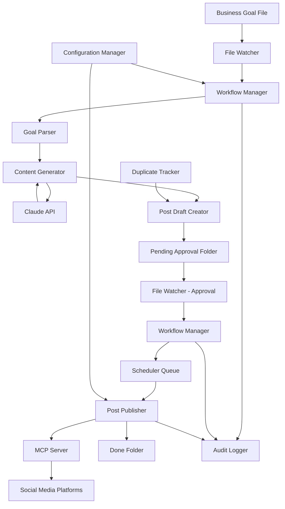
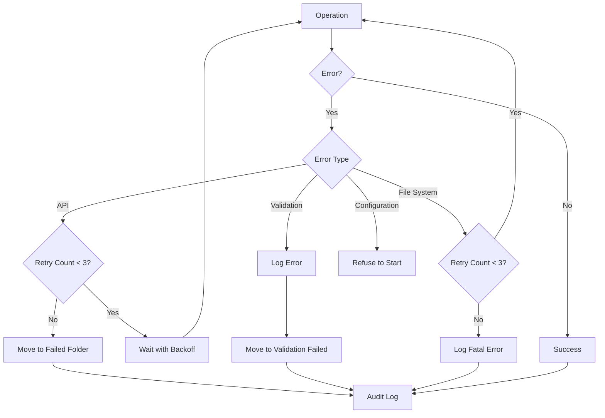

# Design Document: Social Media Posting Workflow

## Overview

The social media posting workflow is an automated system that transforms business goals into published social media content through a human-in-the-loop approval process. The system integrates with Claude AI for content generation and MCP (Model Context Protocol) servers for multi-platform publishing.

The workflow follows the Ralph Loop architecture:
- **Perception**: File_Watcher monitors folder changes and detects new Business_Goals and approvals
- **Reasoning**: Claude_API generates platform-optimized content based on business requirements
- **Action**: MCP_Server publishes approved content to social media platforms

The system operates within an Obsidian vault structure with designated folders representing workflow stages:
- `Needs_Action/` - New business goals awaiting processing
- `Pending_Approval/` - Generated posts awaiting human review
- `Approved/` - Posts approved for publishing
- `Done/` - Successfully published posts
- `Logs/` - Audit trail and system logs

## Architecture

### High-Level Architecture



### Component Responsibilities

**WorkflowManager**
- Orchestrates the entire workflow from goal to publication
- Coordinates between components
- Manages workflow state transitions
- Handles error recovery and retry logic

**GoalParser**
- Parses Business_Goal markdown files
- Validates required fields and structure
- Extracts frontmatter metadata and content requirements
- Returns structured GoalData objects

**ContentGenerator**
- Interfaces with Claude_API for content generation
- Applies platform-specific constraints and formatting rules
- Manages template application
- Handles generation retries with exponential backoff

**PostDraftCreator**
- Creates Post_Draft files with unique identifiers
- Populates frontmatter metadata
- Generates platform-specific file names
- Integrates with DuplicateTracker for duplicate detection

**FileWatcher**
- Monitors Needs_Action, Pending_Approval, and Approved folders
- Detects file additions, moves, and deletions
- Triggers workflow events based on file changes
- Implements debouncing to handle rapid changes

**SchedulerQueue**
- Maintains priority queue of scheduled posts
- Sorts posts by scheduled_time
- Triggers posting when scheduled time is reached
- Handles immediate posting for posts without scheduled_time

**PostPublisher**
- Interfaces with MCP_Server for platform posting
- Manages authentication and API credentials
- Implements retry logic for failed posts
- Updates post status and moves files to Done folder

**MCPClient**
- Abstracts MCP_Server communication
- Supports multiple platform endpoints (Twitter, LinkedIn, Facebook, Instagram)
- Handles platform-specific API requirements
- Manages rate limiting and API quotas

## Components and Interfaces

### GoalParser

```typescript
interface GoalData {
  id: string;
  objective: string;
  target_audience: string;
  key_messages: string[];
  platforms: Platform[];
  tone?: string;
  scheduled_time?: string;
  template?: string;
  platform_overrides?: Record<Platform, PlatformOverride>;
}

interface PlatformOverride {
  message?: string;
  scheduled_time?: string;
  hashtags?: string[];
}

class GoalParser {
  parse(filePath: string): Result<GoalData, ParseError>
  validate(goalData: GoalData): Result<void, ValidationError>
}
```

**Key Methods:**
- `parse()`: Reads markdown file, extracts frontmatter and content, returns GoalData
- `validate()`: Checks required fields, validates platform names, validates date formats

### ContentGenerator

```typescript
interface GenerationRequest {
  goalData: GoalData;
  platform: Platform;
  template?: PostTemplate;
}

interface GeneratedContent {
  content: string;
  hashtags: string[];
  metadata: Record<string, any>;
}

class ContentGenerator {
  generate(request: GenerationRequest): Promise<Result<GeneratedContent, GenerationError>>
  applyTemplate(template: PostTemplate, goalData: GoalData): string
  getPlatformConstraints(platform: Platform): PlatformConstraints
}
```

**Key Methods:**
- `generate()`: Sends request to Claude_API with platform constraints, returns generated content
- `applyTemplate()`: Applies template structure and replaces variables
- `getPlatformConstraints()`: Returns character limits, formatting rules for platform

### PostDraftCreator

```typescript
interface PostDraft {
  post_id: string;
  created_date: string;
  target_platform: Platform;
  status: PostStatus;
  business_goal_reference: string;
  scheduled_time?: string;
  content: string;
  hashtags: string[];
  duplicate_warning?: boolean;
}

class PostDraftCreator {
  create(goalData: GoalData, content: GeneratedContent, platform: Platform): Result<PostDraft, CreateError>
  save(draft: PostDraft, folder: string): Result<string, FileError>
  checkDuplicate(content: string, platform: Platform): boolean
}
```

**Key Methods:**
- `create()`: Generates unique post_id, populates metadata, checks for duplicates
- `save()`: Writes markdown file with frontmatter to specified folder
- `checkDuplicate()`: Uses DuplicateTracker to detect similar content in last 30 days

### FileWatcher

```typescript
interface FileEvent {
  type: 'added' | 'moved' | 'deleted';
  path: string;
  timestamp: Date;
}

class FileWatcher {
  watch(folders: string[]): void
  onFileEvent(callback: (event: FileEvent) => void): void
  stop(): void
}
```

**Key Methods:**
- `watch()`: Starts monitoring specified folders for changes
- `onFileEvent()`: Registers callback for file system events
- `stop()`: Stops file watching and cleans up resources

### SchedulerQueue

```typescript
interface ScheduledPost {
  draft: PostDraft;
  scheduled_time: Date;
  priority: number;
}

class SchedulerQueue {
  enqueue(post: ScheduledPost): void
  getNextDue(): ScheduledPost | null
  remove(post_id: string): boolean
  size(): number
}
```

**Key Methods:**
- `enqueue()`: Adds post to queue, maintains sort order by scheduled_time
- `getNextDue()`: Returns next post where scheduled_time <= current time
- `remove()`: Removes post from queue by post_id

### PostPublisher

```typescript
interface PublishResult {
  success: boolean;
  platform_post_id?: string;
  error?: string;
}

class PostPublisher {
  publish(draft: PostDraft): Promise<Result<PublishResult, PublishError>>
  retry(draft: PostDraft, attempts: number): Promise<Result<PublishResult, PublishError>>
  updateStatus(draft: PostDraft, status: PostStatus): Result<void, FileError>
}
```

**Key Methods:**
- `publish()`: Sends post to MCP_Server, handles response
- `retry()`: Implements retry logic with 60-second intervals
- `updateStatus()`: Updates post frontmatter and moves file to appropriate folder

### MCPClient

```typescript
interface MCPRequest {
  platform: Platform;
  content: string;
  metadata: Record<string, any>;
}

interface MCPResponse {
  post_id: string;
  url: string;
  timestamp: string;
}

class MCPClient {
  post(request: MCPRequest): Promise<Result<MCPResponse, MCPError>>
  authenticate(platform: Platform): Promise<Result<void, AuthError>>
  getEndpoint(platform: Platform): string
}
```

**Key Methods:**
- `post()`: Sends HTTP request to MCP_Server endpoint with post data
- `authenticate()`: Retrieves credentials from ConfigurationManager and authenticates
- `getEndpoint()`: Returns platform-specific MCP_Server URL

### WorkflowManager

```typescript
class WorkflowManager {
  processNewGoal(filePath: string): Promise<void>
  processApproval(filePath: string): Promise<void>
  handleError(error: Error, context: WorkflowContext): void
  start(): void
  stop(): void
}
```

**Key Methods:**
- `processNewGoal()`: Orchestrates goal parsing, content generation, and draft creation
- `processApproval()`: Handles approved posts, schedules or publishes immediately
- `handleError()`: Implements error recovery, logging, and file movement
- `start()`: Initializes components and starts file watching
- `stop()`: Gracefully shuts down workflow and saves state

## Data Models

### Business Goal File Format

```markdown
---
id: goal_20240115_001
objective: "Announce new product feature launch"
target_audience: "Existing customers and prospects"
key_messages:
  - "New AI-powered analytics dashboard"
  - "Available to all premium users"
  - "Free trial for 30 days"
platforms:
  - twitter
  - linkedin
tone: "professional and exciting"
scheduled_time: "2024-01-20T10:00:00Z"
template: "product_announcement"
platform_overrides:
  twitter:
    scheduled_time: "2024-01-20T09:00:00Z"
---

# Product Feature Launch

We're launching a new AI-powered analytics dashboard that provides real-time insights...

[Additional context and details]
```

### Post Draft File Format

```markdown
---
post_id: post_20240115_001_twitter
created_date: "2024-01-15T14:30:00Z"
target_platform: twitter
status: pending_approval
business_goal_reference: goal_20240115_001
scheduled_time: "2024-01-20T09:00:00Z"
duplicate_warning: false
character_count: 275
---

🚀 Exciting news! We're launching our new AI-powered analytics dashboard. Get real-time insights that drive decisions. 

✨ Available to all premium users
🎁 30-day free trial

Try it today: [link]

#Analytics #AI #ProductLaunch
```

### Tracking Data Format

```json
{
  "goal_id": "goal_20240115_001",
  "created_at": "2024-01-15T14:30:00Z",
  "posts": [
    {
      "post_id": "post_20240115_001_twitter",
      "platform": "twitter",
      "status": "published",
      "draft_created": "2024-01-15T14:30:15Z",
      "approved": "2024-01-15T15:45:00Z",
      "published": "2024-01-20T09:00:05Z",
      "platform_post_id": "1234567890",
      "platform_url": "https://twitter.com/user/status/1234567890"
    },
    {
      "post_id": "post_20240115_001_linkedin",
      "platform": "linkedin",
      "status": "published",
      "draft_created": "2024-01-15T14:30:20Z",
      "approved": "2024-01-15T15:45:00Z",
      "published": "2024-01-20T10:00:03Z",
      "platform_post_id": "urn:li:share:9876543210",
      "platform_url": "https://linkedin.com/feed/update/urn:li:share:9876543210"
    }
  ],
  "metrics": {
    "goal_to_draft_seconds": 15,
    "draft_to_approval_seconds": 4485,
    "approval_to_publish_seconds": 388805
  }
}
```

### Platform Constraints

```typescript
const PLATFORM_CONSTRAINTS: Record<Platform, PlatformConstraints> = {
  twitter: {
    max_characters: 280,
    supports_hashtags: true,
    supports_mentions: true,
    supports_media: true,
    max_hashtags: 10
  },
  linkedin: {
    max_characters: 3000,
    supports_hashtags: true,
    supports_mentions: true,
    supports_media: true,
    max_hashtags: 30
  },
  facebook: {
    max_characters: 63206,
    supports_hashtags: true,
    supports_mentions: true,
    supports_media: true,
    max_hashtags: 30
  },
  instagram: {
    max_characters: 2200,
    supports_hashtags: true,
    supports_mentions: true,
    supports_media: true,
    max_hashtags: 30,
    requires_media: true
  }
};
```


## Correctness Properties

A property is a characteristic or behavior that should hold true across all valid executions of a system—essentially, a formal statement about what the system should do. Properties serve as the bridge between human-readable specifications and machine-verifiable correctness guarantees.

### Property Reflection

After analyzing all acceptance criteria, I identified several areas of redundancy:

1. **Parsing and Validation**: Multiple properties about parsing (1.1, 1.5) and validation (1.2, 1.3) can be consolidated into comprehensive parsing and validation properties
2. **Retry Logic**: Properties 2.5, 6.4, 9.2, 9.3, 9.4 all test retry behavior - can be consolidated into retry pattern properties
3. **File Movement**: Properties 1.3, 2.6, 6.5, 7.5 all test error handling with file movement - can be consolidated
4. **Logging**: Properties 4.1, 9.1, 10.1, 10.2, 10.3 all test logging behavior - can be consolidated into comprehensive logging properties
5. **Multi-platform**: Properties 2.4, 3.5, 12.1, 12.3 all test multi-platform generation - can be consolidated
6. **Metadata Preservation**: Properties 3.2, 3.4, 11.1 all test metadata completeness - can be consolidated

### Core Properties

**Property 1: Business Goal Parsing Completeness**
*For any* valid Business_Goal markdown file, parsing should extract all fields from frontmatter (objective, target_audience, key_messages, platforms, tone, scheduled_time, template, platform_overrides) and content sections without loss of information.
**Validates: Requirements 1.1, 1.5**

**Property 2: Business Goal Validation Enforcement**
*For any* Business_Goal file missing required fields (objective, target_audience, key_messages, or platforms), validation should fail and the file should be moved to the validation_failed subfolder with an error log entry.
**Validates: Requirements 1.2, 1.3**

**Property 3: Multi-Platform Generation Completeness**
*For any* Business_Goal specifying N platforms, the system should generate exactly N Post_Draft files, each targeting a different platform, all linked to the same Business_Goal reference.
**Validates: Requirements 1.4, 2.4, 3.5, 12.1, 12.3**

**Property 4: Platform Constraints Application**
*For any* content generation request, the Claude_API request should include the correct platform-specific constraints (character limits, hashtag conventions, formatting rules) for the target platform.
**Validates: Requirements 2.2**

**Property 5: Post Draft Creation from Generated Content**
*For any* successful Claude_API response, the system should create a Post_Draft file in the Pending_Approval folder with all required frontmatter fields (post_id, created_date, target_platform, status, business_goal_reference, scheduled_time) and the generated content.
**Validates: Requirements 2.3, 3.2, 3.4**

**Property 6: Exponential Backoff Retry Pattern**
*For any* Claude_API timeout or failure, the system should retry with exponential backoff intervals (1s, 2s, 4s) up to 3 attempts before moving the Business_Goal to generation_failed subfolder.
**Validates: Requirements 2.5, 2.6, 9.2**

**Property 7: Post ID Uniqueness**
*For any* set of generated Post_Drafts, all post_id values should be unique across the entire system.
**Validates: Requirements 3.1**

**Property 8: Post Draft File Naming Convention**
*For any* Post_Draft saved to disk, the filename should follow the pattern `{platform}_{timestamp}_{post_id}.md` where platform matches target_platform, timestamp is in ISO format, and post_id matches the frontmatter post_id.
**Validates: Requirements 3.3**

**Property 9: Approval Workflow File Validation**
*For any* Post_Draft moved to the Approved folder, validation should verify that the file structure is valid markdown with complete frontmatter metadata before proceeding to scheduling.
**Validates: Requirements 4.3**

**Property 10: Scheduler Queue Ordering Invariant**
*For any* sequence of posts added to the SchedulerQueue, the queue should maintain sorted order by scheduled_time, with the earliest scheduled post always at the front.
**Validates: Requirements 5.4**

**Property 11: Immediate vs Scheduled Posting**
*For any* Approved_Post without a scheduled_time field, the system should trigger immediate posting, while posts with scheduled_time should be queued until the scheduled time is reached.
**Validates: Requirements 5.1, 5.3, 5.5**

**Property 12: Scheduled Time Validation**
*For any* Approved_Post with a scheduled_time field, validation should verify that the time is in ISO 8601 format and represents a future timestamp.
**Validates: Requirements 5.2**

**Property 13: MCP Authentication Consistency**
*For any* post publishing request to MCP_Server, the system should include authentication credentials retrieved from ConfigurationManager for the target platform.
**Validates: Requirements 6.2**

**Property 14: Successful Post Status Update**
*For any* successful MCP_Server post response, the system should update the Post_Draft status to "published", record the platform_post_id, and move the file to the Done folder.
**Validates: Requirements 6.3**

**Property 15: Fixed Interval Retry Pattern**
*For any* MCP_Server posting error, the system should retry with fixed 60-second intervals up to 3 attempts before moving the post to posting_failed subfolder.
**Validates: Requirements 6.4, 6.5, 9.3**

**Property 16: Platform Endpoint Routing**
*For any* post targeting a specific platform (Twitter, LinkedIn, Facebook, Instagram), the MCP_Client should route the request to the correct platform-specific endpoint.
**Validates: Requirements 6.6**

**Property 17: Character Count Validation**
*For any* Post_Draft, validation should verify that the content length does not exceed the platform's character limit before sending to MCP_Server.
**Validates: Requirements 7.4, 7.5**

**Property 18: Template Variable Substitution**
*For any* Post_Template with variables and a Business_Goal with corresponding values, applying the template should replace all variables with the correct Business_Goal values.
**Validates: Requirements 8.2, 8.3**

**Property 19: Missing Template Fallback**
*For any* Business_Goal specifying a non-existent template name, the system should log a warning and proceed with default content generation without blocking the workflow.
**Validates: Requirements 8.4**

**Property 20: Template Platform Validation**
*For any* Post_Template, validation should verify that the template contains required sections for the target platform before use.
**Validates: Requirements 8.5**

**Property 21: File Operation Retry Resilience**
*For any* file operation failure (read, write, move), the system should retry up to 3 times before logging a fatal error, ensuring transient file system issues don't cause permanent failures.
**Validates: Requirements 9.4**

**Property 22: Idempotent Failure Recovery**
*For any* workflow that fails and recovers, the system should maintain operation state to ensure that recovery does not result in duplicate posts being published.
**Validates: Requirements 9.5**

**Property 23: Comprehensive Error Logging**
*For any* API call failure (Claude_API or MCP_Server), the system should log an entry containing timestamp, operation type, error message, and full request details.
**Validates: Requirements 9.1, 10.1**

**Property 24: Workflow State Change Logging**
*For any* workflow state change (goal processing, content generation, approval, posting), the system should create a log entry with timestamp, operation type, file references, and outcome.
**Validates: Requirements 10.2, 10.3**

**Property 25: Published Post Summary Logging**
*For any* successfully published post, the system should create a summary log entry containing all workflow stages (goal received, draft created, approved, published) with timestamps for each stage.
**Validates: Requirements 10.5**

**Property 26: Post Tracking Data Completeness**
*For any* published post, the tracking data should contain post_id, platform, published_time, Business_Goal reference, platform_post_id, and platform_url.
**Validates: Requirements 11.1, 11.2**

**Property 27: Workflow Metrics Calculation**
*For any* completed workflow from Business_Goal to published post, the system should calculate and record metrics for time from goal to draft, draft to approval, and approval to publish.
**Validates: Requirements 11.3**

**Property 28: Post History Query Filtering**
*For any* query with filters (platform, date range, Business_Goal), the system should return only posts matching all specified filter criteria.
**Validates: Requirements 11.4**

**Property 29: Tracking Data Format Validity**
*For any* tracking data written to disk, the data should be valid JSON or YAML that can be parsed without errors.
**Validates: Requirements 11.5**

**Property 30: Cross-Platform Scheduling Synchronization**
*For any* Business_Goal specifying multiple platforms without platform-specific overrides, all generated Post_Drafts should have identical scheduled_time values.
**Validates: Requirements 12.2**

**Property 31: Partial Failure Isolation**
*For any* multi-platform post where one platform posting fails, the system should continue posting to remaining platforms and log the partial failure without blocking successful posts.
**Validates: Requirements 12.4**

**Property 32: Platform Override Application**
*For any* Business_Goal with platform_overrides, the generated Post_Draft for each platform should use the override values (message, scheduled_time, hashtags) when specified, otherwise use the default values.
**Validates: Requirements 12.5**

**Property 33: Configuration Validation on Startup**
*For any* system startup with invalid or missing configuration (Claude_API credentials, MCP_Server endpoints, folder paths), the system should log an error and refuse to start.
**Validates: Requirements 13.3, 13.5**

**Property 34: Configuration Completeness**
*For any* running system, the configuration should contain all required settings: Claude_API credentials, MCP_Server endpoints for all supported platforms, retry limits, timeout values, and folder paths.
**Validates: Requirements 13.2**

**Property 35: Content Hash Duplicate Detection**
*For any* two Post_Drafts with identical content targeting the same platform, the content hash comparison should identify them as duplicates.
**Validates: Requirements 14.2**

**Property 36: Duplicate Warning Flagging**
*For any* Post_Draft where similar content has been posted to the same platform within the last 30 days, the system should add a duplicate_warning flag to the frontmatter and log a warning.
**Validates: Requirements 14.1, 14.3**

**Property 37: File Watcher Event Triggering**
*For any* file moved to the Approved folder, the File_Watcher should detect the change and trigger the posting workflow.
**Validates: Requirements 15.3**

**Property 38: File Deletion Tracking**
*For any* file deleted from Pending_Approval, the File_Watcher should log the deletion and update tracking data to reflect the deletion.
**Validates: Requirements 15.4**

### Round-Trip Properties

**Property 39: Business Goal Serialization Round-Trip**
*For any* valid GoalData object, serializing to markdown format then parsing back should produce an equivalent GoalData object with all fields preserved.
**Validates: Requirements 1.1, 1.5**

**Property 40: Post Draft Serialization Round-Trip**
*For any* valid PostDraft object, serializing to markdown format then parsing back should produce an equivalent PostDraft object with all frontmatter and content preserved.
**Validates: Requirements 3.2, 3.4**

**Property 41: Tracking Data Serialization Round-Trip**
*For any* valid tracking data object, serializing to JSON/YAML then parsing back should produce an equivalent object with all fields preserved.
**Validates: Requirements 11.5**


## Error Handling

### Error Categories

**Validation Errors**
- Invalid Business_Goal format or missing required fields
- Invalid Post_Draft structure or metadata
- Invalid scheduled_time format or past timestamps
- Content exceeding platform character limits
- Invalid configuration or missing credentials

**API Errors**
- Claude_API timeout or rate limiting
- Claude_API authentication failure
- MCP_Server connection failure
- MCP_Server authentication failure
- Platform-specific API errors (rate limits, content policy violations)

**File System Errors**
- File read/write failures
- Permission errors
- Disk space exhaustion
- File locking conflicts

**Workflow Errors**
- Duplicate post detection
- Template not found
- Missing platform endpoint configuration
- Scheduler queue overflow

### Error Handling Strategies

**Retry with Backoff**
- Claude_API failures: Exponential backoff (1s, 2s, 4s) for up to 3 attempts
- MCP_Server failures: Fixed 60-second intervals for up to 3 attempts
- File operations: Immediate retry for up to 3 attempts
- All retries include full error context logging

**Graceful Degradation**
- Missing template: Fall back to default generation
- Duplicate detection: Flag warning but allow human override
- Partial multi-platform failure: Continue with successful platforms
- Non-critical configuration changes: Support hot-reload without restart

**Error Recovery**
- Failed Business_Goals: Move to generation_failed subfolder
- Failed posts: Move to posting_failed subfolder
- Invalid files: Move to validation_failed subfolder
- Maintain operation state to prevent duplicates after recovery

**Error Reporting**
- All errors logged with full context (timestamp, operation, details)
- Critical errors prevent system startup
- Non-critical errors logged as warnings
- User notifications via log entries for pending approvals

### Error Flow Diagram



## Testing Strategy

### Dual Testing Approach

The system requires both unit tests and property-based tests for comprehensive coverage:

**Unit Tests** focus on:
- Specific examples demonstrating correct behavior
- Edge cases (empty content, special characters, boundary conditions)
- Error conditions and error messages
- Integration points between components
- Time-based behaviors (file watcher detection, scheduling)

**Property-Based Tests** focus on:
- Universal properties that hold for all inputs
- Comprehensive input coverage through randomization
- Invariants that must be maintained
- Round-trip properties for serialization
- Idempotence and consistency guarantees

Both approaches are complementary and necessary. Unit tests catch concrete bugs and verify specific scenarios, while property tests verify general correctness across the input space.

### Property-Based Testing Configuration

**Framework Selection:**
- TypeScript/JavaScript: fast-check
- Python: Hypothesis
- Other languages: QuickCheck variants

**Test Configuration:**
- Minimum 100 iterations per property test (due to randomization)
- Each property test must reference its design document property
- Tag format: `Feature: social-media-posting-workflow, Property {number}: {property_text}`
- Each correctness property must be implemented by a SINGLE property-based test

**Example Property Test Structure:**

```typescript
import fc from 'fast-check';

// Feature: social-media-posting-workflow, Property 1: Business Goal Parsing Completeness
test('parsing preserves all Business_Goal fields', () => {
  fc.assert(
    fc.property(
      arbitraryGoalData(),
      (goalData) => {
        const markdown = serializeGoal(goalData);
        const parsed = parseGoal(markdown);
        expect(parsed).toEqual(goalData);
      }
    ),
    { numRuns: 100 }
  );
});
```

### Test Coverage by Component

**GoalParser**
- Unit tests: Specific valid and invalid goal examples
- Property tests: Properties 1, 2, 39 (parsing completeness, validation, round-trip)

**ContentGenerator**
- Unit tests: Specific platform examples, template examples
- Property tests: Properties 4, 6, 18, 19 (constraints, retry, templates)

**PostDraftCreator**
- Unit tests: Specific draft creation examples
- Property tests: Properties 5, 7, 8, 35, 36, 40 (creation, uniqueness, naming, duplicates, round-trip)

**FileWatcher**
- Unit tests: File event detection timing (examples)
- Property tests: Properties 37, 38 (event triggering, deletion tracking)

**SchedulerQueue**
- Unit tests: Specific scheduling scenarios
- Property tests: Properties 10, 11, 12 (queue ordering, immediate vs scheduled)

**PostPublisher**
- Unit tests: Specific success and failure scenarios
- Property tests: Properties 13, 14, 15, 16, 17 (authentication, status updates, retry, routing, validation)

**WorkflowManager**
- Unit tests: End-to-end workflow examples
- Property tests: Properties 3, 22, 23, 24, 25, 31 (multi-platform, idempotence, logging, partial failure)

**Configuration & Tracking**
- Unit tests: Specific configuration scenarios
- Property tests: Properties 26, 27, 28, 29, 33, 34, 41 (tracking, metrics, queries, validation, round-trip)

**Multi-Platform Coordination**
- Unit tests: Specific multi-platform scenarios
- Property tests: Properties 30, 32 (synchronization, overrides)

### Integration Testing

**End-to-End Workflow Tests:**
1. Business_Goal → Draft → Approval → Publishing (happy path)
2. Multi-platform coordination with partial failures
3. Retry and recovery scenarios
4. Duplicate detection and override workflow
5. Template application workflow
6. Scheduled posting workflow

**Component Integration Tests:**
1. FileWatcher + WorkflowManager event handling
2. ContentGenerator + Claude_API integration
3. PostPublisher + MCP_Server integration
4. ConfigurationManager + all components
5. AuditLogger + all workflow state changes
6. DuplicateTracker + PostDraftCreator

### Test Data Generation

**Arbitrary Generators for Property Tests:**

```typescript
// Generate random Business_Goal data
const arbitraryGoalData = (): fc.Arbitrary<GoalData> => {
  return fc.record({
    id: fc.uuid(),
    objective: fc.string({ minLength: 10, maxLength: 200 }),
    target_audience: fc.string({ minLength: 10, maxLength: 100 }),
    key_messages: fc.array(fc.string({ minLength: 5, maxLength: 100 }), { minLength: 1, maxLength: 5 }),
    platforms: fc.array(fc.constantFrom('twitter', 'linkedin', 'facebook', 'instagram'), { minLength: 1, maxLength: 4 }),
    tone: fc.option(fc.constantFrom('professional', 'casual', 'exciting', 'informative')),
    scheduled_time: fc.option(fc.date({ min: new Date() }).map(d => d.toISOString())),
    template: fc.option(fc.string({ minLength: 5, maxLength: 20 })),
    platform_overrides: fc.option(fc.dictionary(
      fc.constantFrom('twitter', 'linkedin', 'facebook', 'instagram'),
      fc.record({
        message: fc.option(fc.string({ minLength: 10, maxLength: 100 })),
        scheduled_time: fc.option(fc.date({ min: new Date() }).map(d => d.toISOString())),
        hashtags: fc.option(fc.array(fc.string({ minLength: 3, maxLength: 20 }), { maxLength: 10 }))
      })
    ))
  });
};

// Generate random Post_Draft data
const arbitraryPostDraft = (): fc.Arbitrary<PostDraft> => {
  return fc.record({
    post_id: fc.uuid(),
    created_date: fc.date().map(d => d.toISOString()),
    target_platform: fc.constantFrom('twitter', 'linkedin', 'facebook', 'instagram'),
    status: fc.constantFrom('pending_approval', 'approved', 'published', 'failed'),
    business_goal_reference: fc.uuid(),
    scheduled_time: fc.option(fc.date({ min: new Date() }).map(d => d.toISOString())),
    content: fc.string({ minLength: 10, maxLength: 3000 }),
    hashtags: fc.array(fc.string({ minLength: 3, maxLength: 20 }), { maxLength: 30 }),
    duplicate_warning: fc.boolean()
  });
};

// Generate platform-appropriate content
const arbitraryPlatformContent = (platform: Platform): fc.Arbitrary<string> => {
  const constraints = PLATFORM_CONSTRAINTS[platform];
  return fc.string({ minLength: 10, maxLength: constraints.max_characters });
};
```

### Mocking Strategy

**External Dependencies to Mock:**
- Claude_API: Mock responses for content generation
- MCP_Server: Mock responses for posting
- File system: Use in-memory file system for tests
- ConfigurationManager: Mock configuration values
- Time: Mock for scheduling and timeout tests

**Real Components in Tests:**
- GoalParser: Test with real parsing logic
- PostDraftCreator: Test with real creation logic
- SchedulerQueue: Test with real queue implementation
- DuplicateTracker: Test with real duplicate detection

### Performance Testing

**Load Testing Scenarios:**
1. Process 100 Business_Goals simultaneously
2. Handle 1000 scheduled posts in queue
3. Detect file changes with 50 concurrent approvals
4. Generate content for 10 platforms per goal

**Performance Targets:**
- File_Watcher detection: < 5 seconds
- Goal parsing: < 100ms per file
- Content generation: < 30 seconds (Claude_API dependent)
- Post publishing: < 5 seconds (MCP_Server dependent)
- Duplicate detection: < 500ms per check

### Continuous Testing

**Pre-commit Hooks:**
- Run unit tests for changed components
- Run linting and type checking
- Verify no console.log statements

**CI/CD Pipeline:**
- Run all unit tests
- Run all property-based tests (100 iterations)
- Run integration tests
- Generate coverage report (target: 80%+ coverage)
- Run performance benchmarks

**Monitoring in Production:**
- Track workflow completion times
- Monitor API failure rates
- Alert on excessive retries
- Track duplicate detection rates
- Monitor queue depth
